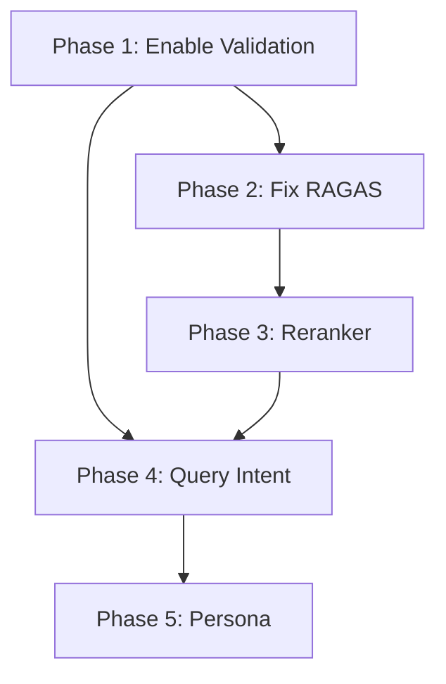

# Implementation Plan: SPEC-RAG-QUALITY-009

## Metadata

| Field | Value |
|-------|-------|
| SPEC ID | SPEC-RAG-QUALITY-009 |
| Created | 2026-02-21 |
| Status | Planned |
| Priority | Critical |

---

## Overview

본 문서는 RAG 시스템 품질 종합 개선을 위한 구현 계획을 정의합니다. 핵심 문제는 이미 구현된 기능이 활성화되지 않았고, RAGAS 평가 파이프라인에 오류가 있다는 점입니다.

---

## Phase 1: Enable Faithfulness Validation (P0 - Critical)

### Goal

이미 구현된 FaithfulnessValidator를 실제 파이프라인에 적용하여 Faithfulness 점수를 0.31에서 0.60+로 개선

### Tasks

#### Task 1.1: Enable Validation by Default

**File**: `src/rag/application/search_usecase.py`

**Changes**:
```python
# Current (implicit default)
use_faithfulness_validation: bool = False

# Change to
use_faithfulness_validation: bool = True
```

**Acceptance Criteria**:
- [ ] `SearchUseCase.__init__()`에서 `use_faithfulness_validation=True` 기본값
- [ ] 로깅으로 validation 활성화 확인

#### Task 1.2: Route to Validation Method

**File**: `src/rag/application/search_usecase.py`

**Changes**:
```python
# Current path
async def _generate_answer(self, query, context):
    # Direct generation without validation
    return await self._llm_generate(query, context)

# Change to
async def _generate_answer(self, query, context):
    if self.use_faithfulness_validation:
        return await self._generate_answer_with_validation(query, context)
    return await self._llm_generate(query, context)
```

**Acceptance Criteria**:
- [ ] `_generate_answer_with_validation()` 호출 확인
- [ ] 재생성 루프 로깅 출력

#### Task 1.3: Add Configuration Support

**File**: `src/rag/config/search_config.py` (new)

**Content**:
```python
from dataclasses import dataclass

@dataclass
class SearchConfig:
    """Configuration for search behavior."""
    use_faithfulness_validation: bool = True
    faithfulness_threshold: float = 0.6
    max_regeneration_attempts: int = 2
    enable_evasive_pattern_detection: bool = True
```

**Acceptance Criteria**:
- [ ] Configuration 클래스 생성
- [ ] SearchUseCase에서 설정 로드

### Metrics

| Metric | Before | After Target |
|--------|--------|--------------|
| Faithfulness | 0.31 | 0.60+ |
| Validation Rate | 0% | 100% |
| Regeneration Rate | 0% | 20-40% |

---

## Phase 2: Fix RAGAS Compatibility (P0 - Critical)

### Goal

RAGAS 평가 파이프라인의 RunConfig/ProgressInfo 오류 해결

### Tasks

#### Task 2.1: Upgrade RAGAS Version

**File**: `pyproject.toml`

**Changes**:
```toml
# Current
"ragas>=0.4.3",

# Change to
"ragas>=0.4.13",
```

**Commands**:
```bash
uv pip install ragas>=0.4.13
```

**Acceptance Criteria**:
- [ ] RAGAS 버전 0.4.13+ 설치 확인
- [ ] Import 오류 미발생

#### Task 2.2: Fix RunConfig Initialization

**File**: `src/rag/domain/evaluation/quality_evaluator.py`

**Changes**:
```python
# Check current RAGAS version and adjust RunConfig
from ragas import __version__ as ragas_version

if ragas_version >= "0.4.13":
    from ragas import RunConfig
    self._run_config = RunConfig(max_wait=60, max_workers=4)
else:
    from ragas.run_config import RunConfig
    self._run_config = RunConfig(max_workers=4)
```

**Acceptance Criteria**:
- [ ] RunConfig 초기화 오류 미발생
- [ ] `on_chain_start` 속성 오류 미발생

#### Task 2.3: Fix ProgressInfo Compatibility

**File**: `src/rag/application/evaluation/progress_reporter.py`

**Changes**:
```python
# Handle ProgressInfo compatibility
try:
    progress.completed += 1
except AttributeError:
    # Fallback for older RAGAS versions
    progress = ProgressInfo(completed=progress.completed + 1, total=progress.total)
```

**Acceptance Criteria**:
- [ ] ProgressInfo 속성 오류 미발생
- [ ] 진행률 표시 정상 작동

#### Task 2.4: Add Fallback Evaluation Framework

**File**: `src/rag/domain/evaluation/quality_evaluator.py`

**Changes**:
```python
async def evaluate(self, sample):
    if not self.use_ragas:
        # Use deepeval as fallback
        return await self._evaluate_with_deepeval(sample)

    try:
        return await self._evaluate_with_ragas(sample)
    except (AttributeError, ImportError) as e:
        logger.warning(f"RAGAS error: {e}, falling back to deepeval")
        return await self._evaluate_with_deepeval(sample)
```

**Acceptance Criteria**:
- [ ] RAGAS 실패 시 deepeval 자동 전환
- [ ] 평가 결과 정상 반환

### Metrics

| Metric | Before | After Target |
|--------|--------|--------------|
| Evaluation Error Rate | 100% | 0% |
| Successful Evaluations | 0 | 100% |

---

## Phase 3: Reranker Optimization (P0 - Critical)

### Goal

검색 정확도를 0.50에서 0.65+로 개선

### Tasks

#### Task 3.1: Document Type Weight Configuration

**File**: `src/rag/infrastructure/reranker.py`

**Changes**:
```python
# Document type weights
DOCUMENT_TYPE_WEIGHTS = {
    "regulation": 1.5,      # 규정 본문
    "procedure": 1.3,       # 절차 안내
    "appendix": 0.7,        # 부칙
    "form": 0.5,            # 서식
    "transitional": 0.5,    # 경과조치
}

def apply_type_weights(self, docs: List[ScoredDocument]) -> List[ScoredDocument]:
    for doc in docs:
        doc_type = doc.metadata.get("document_type", "regulation")
        weight = DOCUMENT_TYPE_WEIGHTS.get(doc_type, 1.0)
        doc.score *= weight
    return docs
```

**Acceptance Criteria**:
- [ ] 문서 타입별 가중치 적용
- [ ] 경과조치/서식 문서 순위 하락 확인

#### Task 3.2: Query-Type Aware Reranking

**File**: `src/rag/application/search_usecase.py`

**Changes**:
```python
INTENT_RERANK_CONFIGS = {
    IntentCategory.PROCEDURE: {"boost_procedure": 1.5, "suppress_form": 0.5},
    IntentCategory.DEADLINE: {"boost_date": 1.3},
    IntentCategory.ELIGIBILITY: {"boost_condition": 1.4},
}
```

**Acceptance Criteria**:
- [ ] 질문 유형별 동적 가중치 적용
- [ ] 절차 질문에서 서식 문서 순위 하락

#### Task 3.3: A/B Test Framework

**File**: `src/rag/infrastructure/reranker_ab_test.py` (new)

**Content**:
```python
class RerankerABTest:
    def __init__(self, model_a: str, model_b: str):
        self.model_a = model_a  # BGE Reranker v2-m3
        self.model_b = model_b  # Ko-reranker

    async def compare(self, query: str, docs: List, ground_truth: str):
        results_a = await self.rerank_with_a(query, docs)
        results_b = await self.rerank_with_b(query, docs)

        return {
            "model_a_score": self.evaluate(results_a, ground_truth),
            "model_b_score": self.evaluate(results_b, ground_truth),
        }
```

**Acceptance Criteria**:
- [ ] A/B 테스트 프레임워크 구현
- [ ] 결과 비교 리포트 생성

### Metrics

| Metric | Before | After Target |
|--------|--------|--------------|
| Contextual Precision | 0.50 | 0.65+ |
| Irrelevant Doc Rate | High | < 20% |

---

## Phase 4: Query Intent Enhancement (P1 - High)

### Goal

질문 의도 파악 개선으로 Answer Relevancy 0.53에서 0.70+로 향상

### Tasks

#### Task 4.1: Enhance Intent Classification Rules

**File**: `src/rag/application/intent_classifier.py`

**Changes**:
```python
# Add rules for ambiguous patterns
AMBIGUOUS_PATTERNS = {
    "XX가 뭐예요?": IntentCategory.DEFINITION,
    "XX 알려주세요": IntentCategory.GENERAL,
    "XX 어떻게 해요?": IntentCategory.PROCEDURE,
    "XX 자격": IntentCategory.ELIGIBILITY,
    "XX 기간": IntentCategory.DEADLINE,
}
```

**Acceptance Criteria**:
- [ ] 모호한 질문 패턴 분류 정확도 >= 85%
- [ ] Intent 분류 로깅 추가

#### Task 4.2: Evasive Pattern Detection

**File**: `src/rag/application/evasive_pattern_detector.py` (new)

**Content**:
```python
EVASIVE_PATTERNS = [
    r"홈페이지.*참고",
    r"관련 부서.*문의",
    r"제공된.*컨텍스트.*확인.*없",
    r"정확한.*정보.*확인",
]

class EvasivePatternDetector:
    def detect(self, answer: str) -> tuple[bool, str]:
        for pattern in EVASIVE_PATTERNS:
            if re.search(pattern, answer):
                return True, pattern
        return False, ""
```

**Acceptance Criteria**:
- [ ] 회피성 답변 감지 정확도 >= 90%
- [ ] 감지 시 자동 재생성 트리거

#### Task 4.3: Clarification Question Generation

**File**: `src/rag/application/clarification_generator.py` (new)

**Content**:
```python
CLARIFICATION_TEMPLATES = {
    IntentCategory.DEFINITION: "구체적으로 어떤 {topic} 내용을 알고 싶으신가요? (절차, 자격, 기간 등)",
    IntentCategory.PROCEDURE: "{topic}의 어떤 단계를 알고 싶으신가요? (신청, 승인, 결과 등)",
}
```

**Acceptance Criteria**:
- [ ] 명확화 질문 템플릿 구현
- [ ] 모호한 질문 감지 시 명확화 요청

### Metrics

| Metric | Before | After Target |
|--------|--------|--------------|
| Answer Relevancy | 0.53 | 0.70+ |
| Intent Classification Accuracy | 70% | 85%+ |
| Evasive Response Rate | High | < 5% |

---

## Phase 5: Persona Evaluation System (P2 - Medium)

### Goal

6가지 페르소나 기반 평가 시스템 구현

### Tasks

#### Task 5.1: Define Personas

**File**: `src/rag/domain/evaluation/persona_definitions.py` (new)

**Content**:
```python
PERSONAS = {
    "freshman": {
        "name": "신입생",
        "characteristics": ["간단명료", "최소 인용", "기본 용어"],
        "query_patterns": ["XX가 뭐예요?", "XX 어떻게 해요?"],
    },
    "student": {
        "name": "재학생",
        "characteristics": ["절차 중심", "구체적 안내", "날짜 포함"],
        "query_patterns": ["XX 신청 방법", "XX 기간"],
    },
    "professor": {
        "name": "교수",
        "characteristics": ["정책 중심", "전문 용어", "근거 조항"],
        "query_patterns": ["XX 규정 제X조", "XX 정책"],
    },
    "staff": {
        "name": "직원",
        "characteristics": ["행정 절차", "담당 부서", "연락처"],
        "query_patterns": ["XX 처리 절차", "XX 담당 부서"],
    },
    "parent": {
        "name": "학부모",
        "characteristics": ["친절한 설명", "연락처 포함", "상세 안내"],
        "query_patterns": ["자녀 XX", "XX 알려주세요"],
    },
    "international": {
        "name": "외국인 유학생",
        "characteristics": ["간단한 한국어", "영어 지원", "비자 관련"],
        "query_patterns": ["visa", "international student"],
    },
}
```

**Acceptance Criteria**:
- [ ] 6가지 페르소나 정의 완료
- [ ] 각 페르소나별 특성 및 쿼리 패턴 정의

#### Task 5.2: Persona Query Templates

**File**: `src/rag/domain/evaluation/persona_queries.json` (new)

**Content**:
```json
{
  "freshman": [
    "휴학이 뭐예요?",
    "복학 어떻게 해요?",
    "장학금 뭐예요?"
  ],
  "student": [
    "휴학 신청 기간 언제까지?",
    "복학 신청 방법 알려주세요",
    "장학금 신청 자격이 어떻게 돼요?"
  ],
  ...
}
```

**Acceptance Criteria**:
- [ ] 페르소나별 쿼리 템플릿 10개 이상
- [ ] JSON 형식으로 저장

#### Task 5.3: PersonaEvaluator Implementation

**File**: `src/rag/domain/evaluation/persona_evaluator.py` (new)

**Content**:
```python
class PersonaEvaluator:
    def __init__(self, base_evaluator: RAGQualityEvaluator):
        self.base_evaluator = base_evaluator
        self.personas = PERSONAS

    async def evaluate_persona(
        self,
        persona_id: str,
        queries: List[str],
        search_usecase: "SearchUseCase"
    ) -> PersonaEvaluationResult:
        results = []
        for query in queries:
            answer = await search_usecase.search(query)
            eval_result = await self.base_evaluator.evaluate(...)
            results.append(eval_result)

        return PersonaEvaluationResult(
            persona_id=persona_id,
            avg_score=sum(r.overall_score for r in results) / len(results),
            results=results
        )
```

**Acceptance Criteria**:
- [ ] PersonaEvaluator 클래스 구현
- [ ] 페르소나별 평가 실행 기능

### Metrics

| Metric | Target |
|--------|--------|
| Persona Coverage | 6 personas |
| Queries per Persona | 10+ |
| Evaluation Time | < 5 min per persona |

---

## Testing Strategy

### Unit Tests

- `test_faithfulness_validation_enabled.py`: Validation 활성화 테스트
- `test_ragas_compatibility.py`: RAGAS 호환성 테스트
- `test_reranker_weights.py`: Reranker 가중치 테스트
- `test_evasive_pattern_detection.py`: 회피성 답변 감지 테스트

### Integration Tests

- `test_full_pipeline_improvement.py`: 전체 파이프라인 개선 테스트
- `test_evaluation_accuracy.py`: 평가 정확도 테스트

### Evaluation Tests

- `verify_phase_4_5.sh`: 기존 검증 스크립트 활용
- `verify_quality_improvement.py`: 품질 개선 검증 스크립트

---

## Rollout Plan

### Week 1: P0 Tasks

1. Faithfulness Validation 활성화
2. RAGAS 호환성 수정
3. 초기 평가 실행 및 검증

### Week 2: P0 Tasks Continued

1. Reranker 최적화
2. 2차 평가 실행
3. Contextual Precision 개선 확인

### Week 3-4: P1 Tasks

1. Query Intent 강화
2. 회피성 답변 제거
3. 최종 평가 및 검증

### Week 5+: P2 Tasks

1. 페르소나 평가 시스템
2. 지속적 모니터링

---

## Dependencies



---

## Rollback Plan

### Phase 1 Rollback

```python
# Disable validation if issues arise
use_faithfulness_validation = False
```

### Phase 2 Rollback

```bash
# Revert RAGAS version
uv pip install ragas==0.4.3
```

### Phase 3 Rollback

```python
# Reset document weights to 1.0
DOCUMENT_TYPE_WEIGHTS = {k: 1.0 for k in DOCUMENT_TYPE_WEIGHTS}
```

---

## Monitoring

### Key Metrics to Track

1. **Faithfulness Score**: Real-time via SPEC-RAG-MONITOR-001
2. **Evaluation Error Rate**: RAGAS/deepeval success rate
3. **Response Time**: With validation enabled
4. **Regeneration Rate**: Percentage of answers requiring regeneration

### Alerts

- Faithfulness < 0.5 after Phase 1: CRITICAL
- RAGAS Error Rate > 5%: HIGH
- Response Time > 5s: MEDIUM

---

## References

- SPEC-RAG-QUALITY-008: Previous implementation
- SPEC-RAG-MONITOR-001: Monitoring system
- Quality Analysis Report: `data/evaluations/quality_analysis_report_20260221.md`
