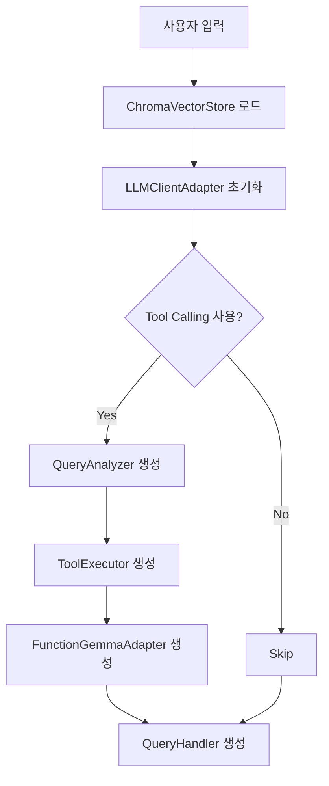
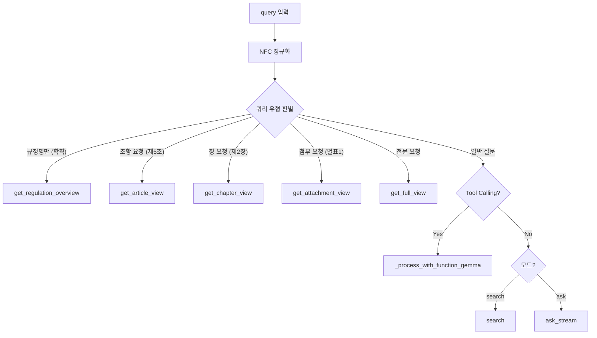
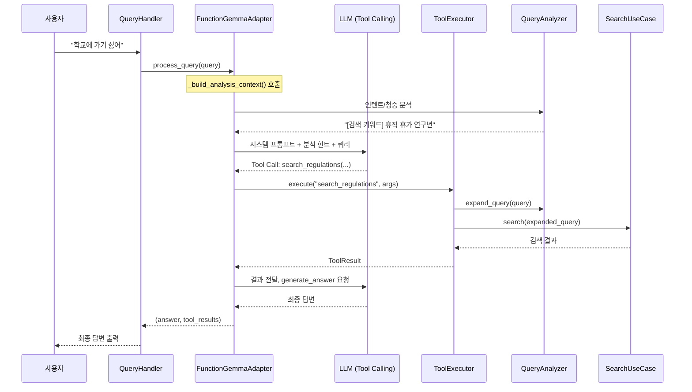
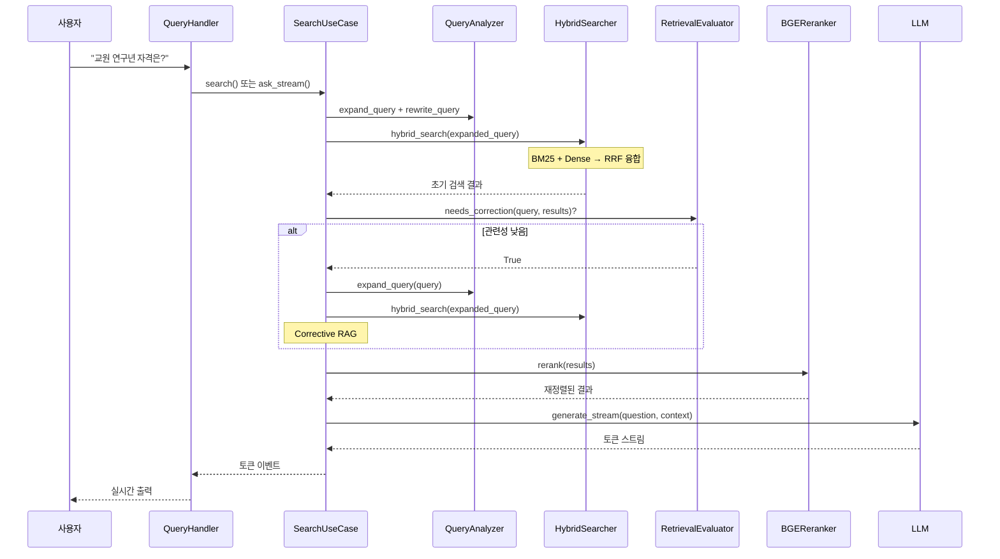

# AI 에이전트 컨텍스트 (AGENTS.md)

> 이 문서는 AI 에이전트(Gemini CLI, Cursor, GitHub Copilot, Claude, Codex 등)가 프로젝트를 이해하고 작업할 때 참조하는 컨텍스트입니다.

---

## 빠른 컨텍스트 (10줄 요약)

```
📦 프로젝트: 대학 규정 관리 시스템 (HWP → JSON → RAG 검색)
📁 구조: src/rag/ 아래 Clean Architecture (domain/, application/, infrastructure/, interface/)
🧪 테스트: TDD 필수 - 기능 구현 전 테스트 먼저 작성
🐍 환경: Python 3.11+, uv 패키지 매니저 (pip/conda 금지)
📜 진입점: `regulation` CLI (convert, sync, search, serve)

⚠️ 핵심 제약:
1. Domain 레이어에서 외부 라이브러리 import 금지
2. 테스트 없이 기능 추가 금지
3. data/chroma_db/, sync_state.json 직접 조작 금지
```

---

## 프로젝트 개요

### 시스템 소개

**이름**: 대학 규정 관리 시스템 (Regulation Manager)

**목적**: 대학 규정집(HWP)을 구조화된 JSON으로 변환하고, Hybrid RAG 기반 AI 검색 및 Q&A를 제공합니다.

**핵심 기능**:

1. **HWP → JSON 변환**: 계층 구조(편/장/절/조/항/호/목) 보존, RAG 최적화 필드 자동 생성
2. **벡터 DB 동기화**: ChromaDB + BGE-M3 임베딩 (1024차원, 한국어 최적화)
3. **하이브리드 검색**: BM25 (키워드) + Dense (의미) + BGE Reranker (재정렬)
4. **LLM 기반 Q&A**: 다양한 프로바이더 지원 (Ollama, OpenAI, Gemini 등)

### 인터페이스

| 인터페이스 | 명령어 | 설명 |
|------------|--------|------|
| CLI | `regulation` | 변환, 검색, 질문, 동기화 통합 |
| Web UI | `regulation serve --web` | Gradio 기반 채팅 인터페이스 |
| MCP Server | `regulation serve --mcp` | AI 에이전트(Claude, Cursor) 연동 |

---

## 아키텍처 원칙

### Clean Architecture

본 프로젝트는 **Clean Architecture** 원칙을 따릅니다. 의존성은 항상 안쪽(Domain)을 향해야 합니다.

```
[Interface] → [Application] → [Domain] ← [Infrastructure]
     ↓              ↓             ↑              ↑
   CLI/Web      Use Cases     Entities      ChromaDB/LLM
```

**레이어별 책임**:

| 레이어 | 위치 | 책임 | 의존성 |
|--------|------|------|--------|
| **Domain** | `src/rag/domain/` | 비즈니스 로직, 엔티티, 인터페이스 정의 | 없음 (순수 Python) |
| **Application** | `src/rag/application/` | Use Cases (검색, 동기화 로직) | Domain만 |
| **Infrastructure** | `src/rag/infrastructure/` | 외부 시스템 구현 (DB, LLM, 검색) | Domain 인터페이스 구현 |
| **Interface** | `src/rag/interface/` | CLI, Web UI, MCP Server | Application 호출 |

**왜 이렇게 구성하는가?**

- **테스트 용이성**: Domain과 Application은 외부 의존성이 없어 단위 테스트가 쉽습니다.
- **유연성**: Infrastructure를 교체해도 비즈니스 로직에 영향이 없습니다 (예: ChromaDB → Qdrant).
- **명확한 책임 분리**: 각 레이어의 역할이 명확하여 코드 이해와 유지보수가 용이합니다.

### TDD (Test-Driven Development)

```
RED → GREEN → REFACTOR
```

1. **RED**: 실패하는 테스트를 먼저 작성합니다.
2. **GREEN**: 테스트를 통과하는 최소한의 코드를 작성합니다.
3. **REFACTOR**: 테스트가 통과한 상태에서 코드를 개선합니다.

**테스트 명령어**:

```bash
uv run pytest                      # 전체 테스트
uv run pytest tests/rag/ -v        # RAG 모듈 테스트
uv run pytest -k "test_search"     # 특정 패턴 매칭
```

---

## 프로젝트 구조

```
regulation_manager/
├── src/
│   ├── main.py                 # HWP 변환 파이프라인 진입점
│   ├── converter.py            # HWP → HTML 변환 (hwp5html)
│   ├── formatter.py            # HTML → JSON 변환
│   ├── enhance_for_rag.py      # RAG 최적화 필드 추가
│   ├── parsing/                # 파싱 모듈
│   │   ├── regulation_parser.py    # 편/장/절/조/항/호/목 파싱
│   │   └── reference_resolver.py   # 상호 참조 해석
│   └── rag/                    # RAG 시스템 (Clean Architecture)
│       ├── domain/
│       │   ├── entities.py         # Chunk, Regulation, SearchResult
│       │   ├── value_objects.py    # SearchFilter, SyncResult
│       │   └── repositories.py     # IVectorStore, ILLMClient 인터페이스
│       ├── application/
│       │   ├── search_usecase.py   # 검색/질문 로직, Corrective RAG 통합
│       │   ├── full_view_usecase.py # 규정 전문 조회 로직
│       │   └── sync_usecase.py     # 동기화 로직
│       ├── infrastructure/
│       │   ├── chroma_store.py     # ChromaDB 벡터 저장소
│       │   ├── hybrid_search.py    # BM25 + Dense, QueryAnalyzer
│       │   ├── query_analyzer.py   # 쿼리 분석, 인텐트/동의어 확장
│       │   ├── reranker.py         # BGE Reranker
│       │   ├── retrieval_evaluator.py  # Corrective RAG 관련성 평가
│       │   ├── self_rag.py         # Self-RAG 자체 평가 메커니즘
│       │   ├── function_gemma_adapter.py # LLM Tool Calling 어댑터
│       │   ├── tool_executor.py    # 도구 실행기
│       │   ├── tool_definitions.py # 도구 정의 (search_regulations 등)
│       │   ├── llm_adapter.py      # LLM 클라이언트 어댑터
│       │   ├── patterns.py         # 정규식 패턴 정의
│       │   └── json_loader.py      # JSON → Chunk 변환
│       └── interface/
│           ├── unified_cli.py      # 통합 CLI 진입점
│           ├── cli.py              # CLI 로직 (search, sync, status, reset)
│           ├── query_handler.py    # 쿼리 처리 통합 핸들러 (CLI/Web/MCP 공용)
│           ├── chat_logic.py       # 대화 로직 (후속 질문 처리)
│           ├── formatters.py       # 출력 포맷터 (Rich, Markdown)
│           ├── gradio_app.py       # Gradio Web UI
│           └── mcp_server.py       # MCP Server (FastMCP)
├── tests/                      # pytest 테스트
│   ├── test_*.py               # 단위 테스트
│   └── rag/                    # RAG 모듈 테스트
└── data/
    ├── input/                  # HWP 입력 파일
    ├── output/                 # JSON 출력 파일
    ├── chroma_db/              # ChromaDB 저장소 (gitignore)
    ├── sync_state.json         # 동기화 상태 (gitignore)
    └── config/                 # 설정 파일
        ├── synonyms.json       # 동의어 사전 (167개 용어)
        └── intents.json        # 인텐트 규칙 (51개 규칙)
```


---

## 개발 표준

### Python 스타일

| 항목 | 규칙 |
|------|------|
| **버전** | Python 3.11+ |
| **패키지 관리** | `uv` 사용 (`pip`, `conda` 사용 금지) |
| **네이밍** | `snake_case` (함수/변수), `CamelCase` (클래스) |
| **경로** | `pathlib.Path` 사용 |
| **Import** | `src/` 내부에서 상대 import 사용 |
| **들여쓰기** | 4 스페이스 |
| **타입 힌트** | 권장 (함수 시그니처에 명시) |
| **Docstring** | Google 스타일 |

### 금지 사항 (DO NOT)

| 규칙 | 이유 |
|------|------|
| ❌ Domain 레이어에서 외부 라이브러리 import | 비즈니스 로직의 순수성 유지. Domain은 Python 표준 라이브러리만 사용해야 테스트와 교체가 용이합니다. |
| ❌ Use Case에서 Infrastructure 직접 참조 | 의존성 역전 원칙(DIP) 준수. 인터페이스를 통해서만 접근해야 구현체 교체가 가능합니다. |
| ❌ 테스트 없이 기능 추가 | TDD 원칙. 테스트가 기능의 명세 역할을 합니다. |
| ❌ `sync_state.json`, `.env` 수동 수정 | 시스템 무결성 보호. CLI 명령어를 통해서만 상태를 변경해야 합니다. |
| ❌ `data/chroma_db/` 직접 조작 | 데이터베이스 무결성 보호. `sync` 및 `reset` 명령어를 사용하세요. |

### 권장 사항 (DO)

| 규칙 | 이유 |
|------|------|
| ✅ 새 기능 추가 시 테스트 먼저 작성 | TDD 원칙. 테스트가 설계를 이끕니다. |
| ✅ 복잡한 로직은 작은 함수로 분리 | 단일 책임 원칙(SRP). 함수당 하나의 역할만 수행합니다. |
| ✅ 타입 힌트 사용 | IDE 지원과 코드 가독성 향상. |
| ✅ Docstring 작성 (Google 스타일) | 함수의 목적, 파라미터, 반환값을 명시합니다. |
| ✅ 에러 핸들링은 도메인 예외 사용 | `src/exceptions.py`에 정의된 예외 클래스를 사용합니다. |

---

## 핵심 컴포넌트

### 쿼리 처리 파이프라인 (Query Processing Pipeline)

사용자 쿼리가 입력되어 최종 답변이 출력되기까지의 전체 흐름입니다.

#### 1단계: 초기화 (CLI/Web UI)



**핵심 파일:**
- `interface/cli.py`: CLI 초기화 및 사용자 입력 처리
- `interface/gradio_app.py`: Web UI 초기화
- `interface/query_handler.py`: 쿼리 라우팅 및 결과 통합

#### 2단계: 쿼리 라우팅 (QueryHandler.process_query_stream)



**쿼리 유형 판별 패턴** (`infrastructure/patterns.py`):
| 패턴 | 예시 | 처리 방식 |
|------|------|----------|
| `REGULATION_ONLY_PATTERN` | "교원인사규정" | 규정 개요 반환 |
| `RULE_CODE_PATTERN` | "3-1-24" | 해당 규정 검색 |
| `REGULATION_ARTICLE_PATTERN` | "학칙 제15조" | 특정 조항 반환 |
| 첨부 요청 | "별표 1", "서식 2" | 첨부 문서 반환 |
| 전문 요청 | "학칙 전문" | 전체 규정 텍스트 |

#### 3단계: Tool Calling 경로 (Agentic RAG)

LLM이 도구를 선택하고 `ToolExecutor`가 실행하는 에이전트 기반 RAG입니다.



**핵심 파일:**
| 파일 | 역할 |
|------|------|
| `infrastructure/function_gemma_adapter.py` | LLM Tool Calling 관리, 인텐트 힌트 삽입 |
| `infrastructure/tool_executor.py` | 도구 실행, 쿼리 확장 적용 |
| `infrastructure/tool_definitions.py` | 사용 가능한 도구 정의 |

**시스템 프롬프트 구조:**
```
당신은 대학 규정 전문가입니다...

[의도 분석] 사용자의 진짜 의도는 '휴직, 휴가, 연구년' 관련일 수 있습니다.
[대상] 교수/교원
[검색 키워드] 나는 교수인데 학교에 가기 싫어 휴직 휴가 연구년 안식년

작업 순서:
1. 위 분석 결과를 참고하여 search_regulations 도구로 관련 규정을 검색합니다.
   - [검색 키워드]가 제공된 경우, 해당 키워드를 query에 포함하세요.
2. 검색 결과를 바탕으로 generate_answer 도구를 호출하여 최종 답변을 생성합니다.
```

#### 4단계: 전통적 검색/Ask 경로 (Non-Tool Calling)



**핵심 파일:**
| 파일 | 역할 |
|------|------|
| `application/search_usecase.py` | 검색 로직, Corrective RAG 통합 |
| `infrastructure/hybrid_search.py` | BM25 + Dense 하이브리드 검색 |
| `infrastructure/reranker.py` | BGE Cross-Encoder 재정렬 |
| `infrastructure/retrieval_evaluator.py` | 검색 결과 관련성 평가 (Corrective RAG) |

---

### 고급 RAG 기법

#### Corrective RAG

검색 결과의 관련성을 평가하고, 낮으면 쿼리를 확장하여 재검색합니다.

```python
# infrastructure/retrieval_evaluator.py
class RetrievalEvaluator:
    RELEVANCE_THRESHOLD = 0.4
    
    def needs_correction(self, query, results) -> bool:
        score = self.evaluate(query, results)
        return score < self.RELEVANCE_THRESHOLD
```

**평가 기준:**
- Top 결과 점수 (50%)
- 키워드 오버랩 (30%)
- 결과 다양성 (20%)

#### Self-RAG

LLM이 검색 필요성과 결과 품질을 자체 평가합니다.

```python
# infrastructure/self_rag.py
class SelfRAGEvaluator:
    def needs_retrieval(self, query) -> bool: ...
    def evaluate_relevance(self, query, results) -> tuple: ...
    def evaluate_support(self, query, context, answer) -> str: ...
```

> **참고:** Self-RAG는 추가 LLM 호출이 필요하여 기본적으로 비활성화되어 있습니다.

#### 인텐트 확장 (Intent Expansion)

자연어 의도 표현을 검색 키워드로 변환합니다.

| 원본 쿼리 | 확장 결과 |
|-----------|----------|
| 학교 가기 싫어 | 학교 가기 싫어 **휴직 휴가 연구년 안식년** |
| 그만두고 싶어 | 그만두고 싶어 **퇴직 사직 명예퇴직** |
| 장학금 받고 싶어 | 장학금 받고 싶어 **장학금 신청 지급** |

**설정 파일:** `data/config/intents.json`, `data/config/synonyms.json`

---

### 주요 데이터 구조


```python
# domain/entities.py
@dataclass
class Chunk:
    id: str                     # uuid5 (결정적)
    text: str                   # 본문
    title: str                  # 조항 제목
    rule_code: str              # 규정 번호 (예: "3-1-24")
    parent_path: List[str]      # 계층 경로
    embedding_text: str         # 임베딩용 텍스트

@dataclass
class SearchResult:
    chunk: Chunk
    score: float                # 0.0 ~ 1.0
```

### 동의어/인텐트 데이터

| 파일 | 설명 | 수량 |
|------|------|------|
| `data/config/synonyms.json` | 동의어 사전 ("폐과" → "학과 폐지") | 167개 |
| `data/config/intents.json` | 인텐트 규칙 ("학교에 가기 싫어" → "휴직") | 51개 |

---

## 명령어 레퍼런스

```bash
# 환경 설정
uv venv && uv sync
cp .env.example .env

# 대화형 모드 (기본값)
uv run regulation                 # 쿼리 예시 표시, 번호로 선택 가능

# HWP 변환
uv run regulation convert "data/input/규정집.hwp"
uv run regulation convert "data/input/규정집.hwp" --use_llm  # LLM 전처리

# DB 동기화
uv run regulation sync data/output/규정집.json
uv run regulation sync data/output/규정집.json --full   # 전체 재동기화

# 검색
uv run regulation search "교원 연구년 자격" -n 5
uv run regulation search "제15조" --no-rerank
uv run regulation search "휴학" --interactive  # 대화형 모드

# 질문
uv run regulation search "교원 연구년 신청 자격은?" -a
uv run regulation search "휴학 절차" --show-sources -v

# 상태/초기화
uv run regulation status
uv run regulation reset --confirm

# 인터페이스
uv run regulation serve --web     # Web UI (Gradio)
uv run regulation serve --mcp     # MCP Server

# 테스트
uv run pytest
uv run pytest tests/rag/ -v
```

> **상세한 사용법은 [QUICKSTART.md](./QUICKSTART.md)를 참고하세요.**

---

## 수정 시 체크리스트

코드를 수정할 때 아래 체크리스트를 확인하세요.

| 변경 대상 | 영향 범위 | 필수 조치 |
|-----------|----------|----------|
| `SearchUseCase` | CLI, Web UI, MCP Server | 통합 테스트 실행 |
| `QueryAnalyzer` | 검색 품질, 인텐트 확장 | 검색 테스트 케이스 확인 |
| `Reranker` | 재정렬 정확도 | 보너스 점수 로직 검증 |
| `FunctionGemmaAdapter` | Tool Calling, LLM 프롬프트 | 도구 호출 시나리오 테스트 |
| `ToolExecutor` | 도구 실행, 쿼리 확장 | 인텐트 확장 테스트 |
| `RetrievalEvaluator` | Corrective RAG 트리거 | 임계값 조정 시 검색 품질 확인 |
| `SelfRAGEvaluator` | LLM 자체 평가 | 추가 LLM 호출 비용 고려 |
| `QueryHandler` | 모든 쿼리 처리 | CLI/Web 양쪽 테스트 |
| `domain/entities.py` | 전체 시스템 | 모든 테스트 실행 |
| `sync_usecase.py` | 데이터 무결성 | 증분 동기화 테스트 |


---

## 환경 설정

### 환경 변수 (.env)

```bash
# LLM 기본 설정
LLM_PROVIDER=ollama          # ollama, lmstudio, openai, gemini
LLM_MODEL=gemma2             # 모델명 (프로바이더별 상이)
LLM_BASE_URL=http://localhost:11434

# API 키 (클라우드 사용 시)
OPENAI_API_KEY=sk-...
GEMINI_API_KEY=AIza...

# 데이터 경로 (선택)
RAG_DB_PATH=data/chroma_db
RAG_JSON_PATH=data/output/규정집.json

# 동의어/인텐트 사전 (기본값 제공)
RAG_SYNONYMS_PATH=data/config/synonyms.json
RAG_INTENTS_PATH=data/config/intents.json
```

> **LLM 설정에 대한 자세한 내용은 [LLM_GUIDE.md](./LLM_GUIDE.md)를 참고하세요.**

---

## 관련 문서

| 문서 | 설명 |
|------|------|
| [README.md](./README.md) | 시스템 개요 및 상세 기술 설명 |
| [QUICKSTART.md](./QUICKSTART.md) | 빠른 시작 가이드 |
| [SCHEMA_REFERENCE.md](./SCHEMA_REFERENCE.md) | JSON 스키마 명세 |
| [LLM_GUIDE.md](./LLM_GUIDE.md) | LLM 설정 가이드 |
| [docs/QUERY_PIPELINE.md](./docs/QUERY_PIPELINE.md) | 쿼리 처리 파이프라인 상세 |

---

## AI 에이전트별 설정

이 문서는 다양한 AI 에이전트에서 범용적으로 사용됩니다.

### 파일 구조

```
regulation_manager/
├── AGENTS.md                          # 📌 정본 (Canonical Source)
├── GEMINI.md                          # → AGENTS.md 심볼릭 링크
├── CLAUDE.md                          # → AGENTS.md 심볼릭 링크
├── .github/
│   └── copilot-instructions.md        # GitHub Copilot 전용
├── .cursor/
│   └── rules/
│       └── regulation_manager.mdc     # Cursor AI 전용
└── docs/
    └── QUERY_PIPELINE.md              # 상세 파이프라인 문서
```

### Gemini CLI / Antigravity

프로젝트 루트의 `GEMINI.md`를 자동으로 읽습니다.

```bash
# 심볼릭 링크 확인/생성
ls -la GEMINI.md
# lrwxr-xr-x  GEMINI.md -> AGENTS.md

# 없으면 생성
ln -sf AGENTS.md GEMINI.md
```

### GitHub Copilot

`.github/copilot-instructions.md` 파일을 읽습니다. 이 파일은 AGENTS.md를 참조하며 빠른 요약을 제공합니다.

### Cursor

`.cursor/rules/regulation_manager.mdc` 파일을 읽습니다. 또는 프로젝트 루트의 `AGENTS.md`도 자동 인식됩니다.

### Claude Code / Claude Desktop

프로젝트 루트의 `CLAUDE.md`를 읽습니다.

```bash
# 심볼릭 링크 확인/생성
ls -la CLAUDE.md
# lrwxr-xr-x  CLAUDE.md -> AGENTS.md

# 없으면 생성
ln -sf AGENTS.md CLAUDE.md
```

### Codeium / Windsurf

프로젝트 루트의 `AGENTS.md`를 자동 인식합니다.

### OpenAI Codex / ChatGPT

직접 인식하지 않으므로, 대화 시작 시 AGENTS.md 내용을 붙여넣거나 참조하세요.

---

## 문서 유지보수 (AI 에이전트 필독)

> [!IMPORTANT]
> **이 섹션은 AI 에이전트가 문서를 수정할 때 반드시 따라야 하는 지침입니다.**

### 정본 관리

`AGENTS.md`는 **정본(Canonical Source)**입니다.

- `GEMINI.md`, `CLAUDE.md` → 심볼릭 링크이므로 **자동 동기화**됨
- `.github/copilot-instructions.md`, `.cursor/rules/regulation_manager.mdc` → **별도 파일이므로 수동 동기화 필요**

### AI 에이전트 수정 규칙

`AGENTS.md`의 **핵심 내용**이 변경되면, 다음 파일들도 **함께 업데이트**하세요:

1. **`.github/copilot-instructions.md`** - GitHub Copilot용 빠른 참조
2. **`.cursor/rules/regulation_manager.mdc`** - Cursor AI용 규칙 파일

특히 다음 항목이 변경되면 반드시 동기화하세요:
- 프로젝트 구조 (`프로젝트 구조` 섹션)
- 핵심 컴포넌트 목록 (`핵심 컴포넌트` 섹션)
- 개발 원칙 및 금지 사항 (`개발 표준` 섹션)
- 주요 명령어 (`명령어 레퍼런스` 섹션)

### 동기화 예시

```markdown
# AGENTS.md 수정 후
1. .github/copilot-instructions.md의 "Key Components" 테이블 업데이트
2. .cursor/rules/regulation_manager.mdc의 "핵심 컴포넌트" 테이블 업데이트
```


