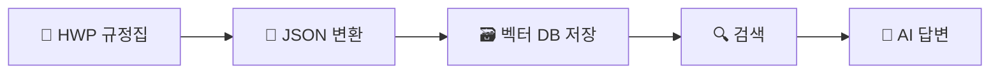
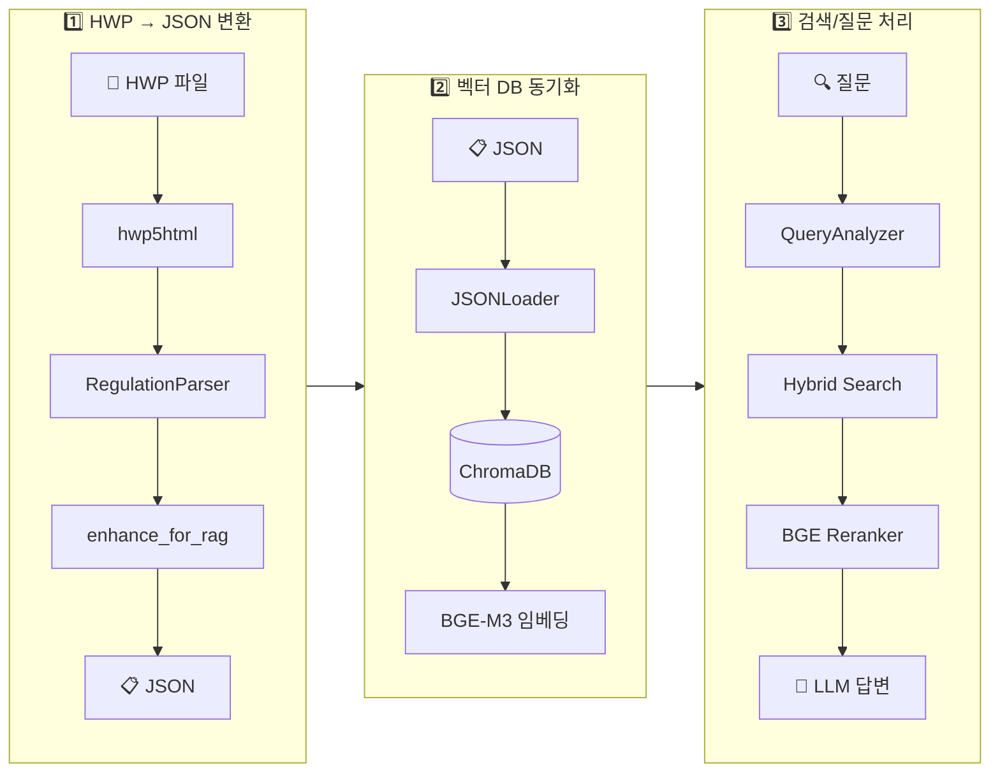
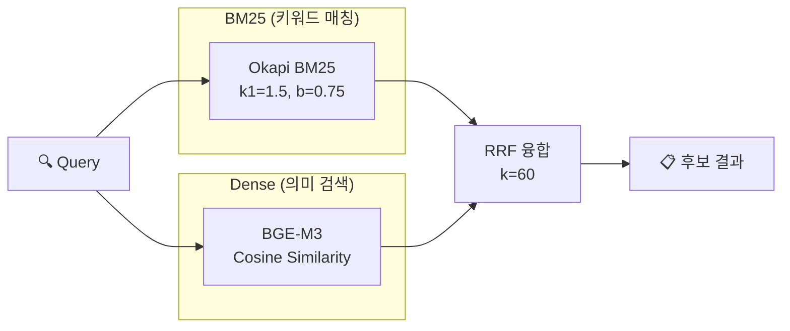

# 대학 규정 관리 시스템 (Regulation Manager)

[](https://www.python.org/downloads/)
[](https://opensource.org/licenses/MIT)

> **대학 규정집(HWP)을 구조화된 JSON으로 변환하고, RAG(검색 증강 생성) 기반으로 자연어 질문에 정확한 답변을 제공하는 오픈소스 AI 검색 시스템**

---

## 목차

- [개요](#개요)
- [한눈에 보기](#한눈에-보기)
- [핵심 개념](#핵심-개념)
- [시스템 요구사항](#시스템-요구사항)
- [빠른 시작](#빠른-시작)
- [기능별 상세 안내](#기능별-상세-안내)
- [명령어 요약](#명령어-요약)
- [시스템 아키텍처](#시스템-아키텍처)
- [처리 파이프라인 상세](#처리-파이프라인-상세)
- [환경 설정](#환경-설정)
- [보안 고려사항](#보안-고려사항)
- [문제 해결](#문제-해결)
- [개발자 정보](#개발자-정보)
- [관련 문서](#관련-문서)

---

## 개요

### 시스템 소개

대학 규정집은 수백 개의 규정과 수천 개의 조항으로 구성된 방대한 문서입니다. 학생이 휴학 절차를 알고 싶거나, 교수가 연구년 자격을 확인하고 싶을 때, 기존 방식으로는 PDF나 HWP 파일을 열어 일일이 검색해야 했습니다.

**규정 관리 시스템**은 이러한 불편함을 해결합니다. HWP 형식의 규정집을 **구조화된 데이터**로 변환하고, **AI 기반 검색**을 통해 자연어 질문에 정확한 답변을 제공합니다.

### 주요 기능

| 기능 | 설명 |
|------|------|
| **규정 변환** | HWP 파일을 계층 구조가 보존된 JSON으로 변환 |
| **지능형 검색** | 키워드와 의미를 모두 고려한 하이브리드 검색 |
| **AI 답변 생성** | 관련 규정을 참조하여 질문에 대한 답변 작성 |
| **다양한 인터페이스** | 명령줄(CLI), 웹 UI, AI 에이전트 연동(MCP) 지원 |

### 대상 사용자

- **학생**: "휴학하려면 어떻게 해야 하나요?"와 같은 질문에 즉시 답변
- **교직원**: 규정 조항을 빠르게 조회하고 업무에 활용
- **행정담당자**: 규정 데이터베이스 관리 및 검색 시스템 운영
- **개발자**: AI 에이전트(Claude, Cursor 등)와 연동하여 규정 검색 자동화

---

## 한눈에 보기

시스템은 크게 **3단계**로 작동합니다:

```text
[1. 변환]              [2. 저장]               [3. 검색/질문]
 HWP 규정집    →    구조화된 JSON    →    자연어로 검색
    📄                   📋                    🔍
```



**처리 흐름 요약**:

1. **변환**: HWP 파일을 편/장/절/조/항/호/목 계층 구조로 파싱하여 JSON 생성
2. **저장**: 각 조항을 벡터 데이터베이스에 저장하여 의미 기반 검색 가능
3. **검색**: 키워드 매칭 + 의미 유사도를 결합한 하이브리드 검색 수행
4. **답변**: AI가 검색 결과를 참고하여 질문에 대한 답변 생성

---

## 핵심 개념

처음 사용하시는 분들을 위해 주요 기술 개념을 설명합니다.

### RAG (Retrieval-Augmented Generation)

**정의**: "검색 증강 생성"이라고 번역되며, AI가 답변을 생성할 때 관련 문서를 먼저 검색하여 참조하는 방식입니다.

**비유**: 오픈북 시험을 생각해 보세요. 학생이 모든 내용을 암기하는 대신, 필요한 정보를 교재에서 찾아 답안을 작성합니다. RAG도 마찬가지로, AI가 질문을 받으면 먼저 규정집에서 관련 조항을 "검색"한 후, 그 내용을 바탕으로 답변을 "생성"합니다.

**장점**: AI가 규정에 없는 내용을 지어내는 "환각(Hallucination)" 현상을 크게 줄여줍니다.

### 벡터 데이터베이스 (Vector Database)

**정의**: 텍스트를 숫자 벡터(임베딩)로 변환하여 저장하고, 의미적으로 유사한 문서를 빠르게 찾을 수 있는 데이터베이스입니다.

**비유**: 도서관의 도서 분류 시스템을 상상해 보세요. 일반 도서관에서는 책을 주제별로 분류하지만, 벡터 데이터베이스는 책의 "의미"를 수치화하여 비슷한 내용의 책을 자동으로 그룹화합니다.

**본 시스템에서의 역할**: ChromaDB를 사용하여 규정 조항을 벡터로 저장하고, 질문과 의미적으로 가장 유사한 조항을 검색합니다.

### 하이브리드 검색 (Hybrid Search)

**정의**: 전통적인 키워드 매칭(BM25)과 의미 기반 벡터 검색(Dense Search)을 결합한 검색 방식입니다.

**왜 필요한가**: 키워드 검색만으로는 "학교 그만두고 싶어요"라는 질문에서 "퇴학"이나 "자퇴" 규정을 찾기 어렵습니다. 반대로, 의미 검색만으로는 "제15조"와 같은 정확한 조문 번호를 찾는 데 부정확할 수 있습니다. 두 방식을 결합하면 양쪽의 장점을 모두 활용할 수 있습니다.

### 임베딩 (Embedding)

**정의**: 텍스트를 고차원 벡터(숫자 배열)로 변환하는 과정입니다.

**비유**: 모든 단어와 문장에 "좌표"를 부여하는 것과 같습니다. 의미가 비슷한 문장들은 가까운 좌표에 위치하게 됩니다.

**본 시스템에서의 활용**: BGE-M3 모델을 사용하여 각 규정 조항을 1024차원 벡터로 변환합니다.

---

## 시스템 요구사항

### 필수 사양

| 항목 | 최소 사양 | 권장 사양 |
|------|----------|----------|
| **운영체제** | macOS 12+, Ubuntu 20.04+ | macOS 14+, Ubuntu 22.04+ |
| **Python** | 3.11 | 3.12 |
| **RAM** | 8GB | 16GB (Reranker 사용 시) |
| **디스크** | 5GB | 10GB+ |
| **GPU** | 불필요 | CUDA 지원 시 임베딩 가속 |

> [!NOTE]
> 현재 Windows는 공식 지원되지 않습니다. WSL2 환경에서 실행을 권장합니다.

### 필수 의존성

- **Python 3.11+**
- **[uv](https://docs.astral.sh/uv/)**: Python 패키지 매니저
- **[hwp5html](https://pypi.org/project/pyhwp/)**: HWP 파일 변환용 CLI 도구

---

## 빠른 시작

> **상세한 단계별 안내는 [QUICKSTART.md](./QUICKSTART.md)를 참고하세요.**

### 1단계: 저장소 클론 및 환경 설정

```bash
# 저장소 클론 (URL을 실제 저장소 주소로 변경하세요)
git clone https://github.com/YOUR_ORG/regulation_manager.git
cd regulation_manager

# Python 가상환경 생성 및 활성화
uv venv && source .venv/bin/activate

# 의존성 설치
uv sync

# 환경 변수 설정
cp .env.example .env
# .env 파일을 편집하여 필요한 설정을 입력하세요
```

### 2단계: hwp5html 설치 (HWP 변환 시 필요)

```bash
# hwp5html CLI 도구 설치
uv add pyhwp

# 설치 확인
uv run hwp5html --help
```

### 3단계: 기본 워크플로우

```bash
# 1. HWP 파일을 JSON으로 변환
uv run regulation convert "data/input/규정집.hwp"

# 2. 벡터 DB에 저장
uv run regulation sync data/output/규정집.json

# 3. 대화형 모드로 시작 (권장)
uv run regulation
```

### 대화형 모드

`regulation` 명령만 실행하면 **대화형 모드**로 시작됩니다:

```text
$ uv run regulation

ℹ 대화형 모드입니다. 아래 예시 중 번호를 선택하거나 직접 질문하세요.

  [1] 휴학 신청 절차가 어떻게 되나요?    # AI 질문/답변
  [2] 교원 연구년                       # 단순 검색
  [3] 교원인사규정 전문                  # 규정 전문 보기
  [4] 학칙 별표 1                       # 별표/서식 조회
  [5] 학교 그만두고 싶어요               # 의도 기반 쿼리 확장

  '/exit' 종료, '/reset' 문맥 초기화, '/help' 도움말

>>> 1   ← 번호 입력으로 예시 선택
  → 휴학 신청 절차가 어떻게 되나요?

... (AI 답변) ...

💡 연관 질문:
  [1] 복학 절차는?
  [2] 휴학 기간 연장은 가능한가요?
  [3] 휴학 중 등록금은?

>>>
```

---

## 기능별 상세 안내

### 검색 및 질문

시스템은 질문 유형을 자동으로 분석하여 적절한 처리 방식을 선택합니다.

| 질문 유형 | 예시 | 처리 방식 |
|----------|------|----------|
| 자연어 질문 | "휴학하려면 어떻게 해야 하나요?" | AI 답변 생성 |
| 키워드 검색 | "교원 연구년" | 관련 문서 목록 반환 |
| 조문 검색 | "제15조", "학칙 제3조" | 해당 조항 직접 표시 |
| 규정 전문 | "교원인사규정 전문" | 규정 전체 구조 표시 |

**명령줄 옵션**:

| 옵션 | 설명 |
|------|------|
| `-a`, `--answer` | AI 답변 생성 강제 (Ask 모드) |
| `-q`, `--quick` | 문서 검색만 수행 (Search 모드) |
| `-n 10` | 검색 결과 개수 지정 |
| `--include-abolished` | 폐지된 규정 포함 |
| `--no-rerank` | AI 재정렬 비활성화 |
| `-v`, `--verbose` | 상세 정보 출력 (쿼리 분석, 모드 결정 이유 등) |

**LLM 옵션**:

| 옵션 | 설명 |
|------|------|
| `--provider ollama` | LLM 프로바이더 (ollama, lmstudio, openai 등) |
| `--model gemma2` | 사용할 모델명 |
| `--show-sources` | 참고 규정 전문 출력 |

> **LLM 설정에 대한 자세한 내용은 [LLM_GUIDE.md](./LLM_GUIDE.md)를 참고하세요.**

### 웹 UI

비개발자를 위한 통합 웹 인터페이스를 제공합니다.

```bash
uv run regulation serve --web
```

**주요 특징**:

- **ChatGPT 스타일 인터페이스**: 채팅 형식의 직관적인 대화 UI
- **예시 쿼리 카드**: 클릭 한 번으로 다양한 검색 기능 체험
- **전문 보기**: "전문/원문/전체" 요청 시 규정 전체 뷰 제공
- **대상 선택**: 교수/학생/직원 대상이 모호할 때 선택 UI 제공

파일 업로드 → 변환 → DB 동기화 → 질문까지 한 화면에서 진행할 수 있습니다.

### RAG 테스팅 자동화

RAG 시스템의 품질을 자동으로 테스트하고 개선 제안을 생성하는 자동화 시스템을 제공합니다.

```bash
# 테스트 자동화 CLI
uv run python -m src.rag.automation.interface.automation_cli test --scenarios 10
uv run python -m src.rag.automation.interface.automation_cli list-sessions
uv run python -m src.rag.automation.interface.automation_cli report --session-id <ID>
```

**주요 기능**:

| 기능 | 설명 |
|------|------|
| **자동 테스트 생성** | LLM 기반 다양한 테스트 시나리오 자동 생성 |
| **테스트 실행** | 자동 생성된 테스트 케이스 실행 및 결과 수집 |
| **품질 평가** | 관련성, 정확성, 완전성 기반 품질 점수 계산 |
| **멀티턴 시뮬레이션** | 대화 맥락이 유지되는 멀티턴 테스트 지원 |
| **컴포넌트 분석** | Retrieval, Rerank, LLM 각 컴포넌트별 성능 분석 |
| **개선 적용** | 분석 결과 기반 자동 개선 제안 생성 |
| **리포트 생성** | HTML/JSON 형식의 상세 테스트 리포트 |

**아키텍처**:

```text
src/rag/automation/
├── domain/          # 도메인 엔티티 및 비즈니스 로직
├── application/     # 유스케이스 (테스트 생성, 실행, 평가)
├── infrastructure/  # LLM, 저장소, 시뮬레이터
└── interface/       # CLI 진입점
```

**테스트 결과 예시**:

```text
✅ 테스트 시나리오 10개 생성 완료
✅ 테스트 실행 완료 (10/10 성공)
📊 품질 점수: 87.5/100
   - 관련성: 92.0%
   - 정확성: 85.0%
   - 완전성: 85.5%

🔍 컴포넌트 분석:
   - Retrieval: 9.2/10 (우수)
   - Rerank: 8.8/10 (양호)
   - LLM: 8.5/10 (양호)

💡 개선 제안 3건 생성됨
📄 리포트 저장됨: data/test_reports/report_20250124_143022.html
```

> RAG 테스팅 자동화는 Clean Architecture로 구현되었으며, 120개의 단위 테스트로 검증되었습니다.

### MCP 서버 (AI 에이전트 연동)

AI 에이전트(Claude, Cursor 등)에서 규정 검색 기능을 사용할 수 있는 MCP(Model Context Protocol) 서버를 제공합니다.

```bash
uv run regulation serve --mcp
```

**지원 도구 (Tools)**:

| Tool | 설명 |
|------|------|
| `search_regulations` | 규정 검색 (Hybrid + Rerank) |
| `ask_regulations` | AI 질문-답변 |
| `get_sync_status` | 동기화 상태 조회 |
| `get_regulation_overview` | 규정 개요(목차, 구조) 조회 |
| `view_article` | 특정 조항 전문 조회 (예: 제8조) |
| `view_chapter` | 특정 장 전문 조회 (예: 제3장) |

**리소스 (Resources)**:

| Resource | 설명 |
|----------|------|
| `status://sync` | 동기화 상태 정보 |
| `list://regulations` | 등록된 규정 목록 |

**Claude Desktop 연결 설정** 예시:

```json
{
  "mcpServers": {
    "regulation-rag": {
      "command": "uv",
      "args": ["run", "regulation", "serve", "--mcp"],
      "cwd": "/path/to/regulation_manager"
    }
  }
}
```

> DB 관리(sync, reset)는 CLI로 수행합니다.

---

## 명령어 요약

모든 기능은 `regulation` 단일 진입점으로 접근합니다.

| 명령어 | 설명 |
|--------|------|
| `regulation` | **대화형 모드 시작 (기본)** |
| `regulation convert "파일.hwp"` | HWP → JSON 변환 |
| `regulation convert "파일.hwp" --use_llm` | LLM 전처리 활성화 |
| `regulation sync <json>` | JSON → 벡터 DB 동기화 |
| `regulation sync <json> --full` | 전체 재동기화 |
| `regulation search "<쿼리>"` | 규정 검색 및 AI 답변 |
| `regulation search "<쿼리>" --interactive` | 대화형 모드 |
| `regulation search "<질문>" -a` | AI 답변 생성 강제 |
| `regulation search "<키워드>" -q` | 문서 검색 강제 |
| `regulation status` | 동기화 상태 확인 |
| `regulation reset --confirm` | DB 초기화 |
| `regulation serve --web` | Web UI 시작 |
| `regulation serve --mcp` | MCP Server 시작 |
| `python -m src.rag.automation.interface.automation_cli test` | RAG 자동 테스트 실행 |
| `python -m src.rag.automation.interface.automation_cli list-sessions` | 테스트 세션 목록 |
| `python -m src.rag.automation.interface.automation_cli report` | 테스트 리포트 생성 |

---

## 시스템 아키텍처

### 전체 구조

시스템은 세 개의 독립적인 파이프라인으로 구성됩니다.



### 기술 스택

| 구성 요소 | 사용 기술 | 역할 |
|----------|----------|------|
| 문서 변환 | hwp5html, Python | HWP → HTML → JSON |
| 벡터 저장 | ChromaDB | 로컬 영속 벡터 데이터베이스 |
| 임베딩 | BAAI/bge-m3 | 1024차원 다국어 임베딩 |
| 재정렬 | BAAI/bge-reranker-v2-m3 | Cross-Encoder 기반 정밀 순위화 |
| 키워드 검색 | BM25 + KoNLPy (Komoran) | 형태소 분석 기반 희소 검색 |
| 고급 RAG | Self-RAG, HyDE, Corrective RAG | 검색 품질 향상 |
| LLM | Ollama, OpenAI, Gemini 등 | 답변 생성 |
| 웹 UI | Gradio | 대화형 웹 인터페이스 |
| MCP | FastMCP | AI 에이전트 연동 |

---

## 처리 파이프라인 상세

### 1️⃣ HWP → JSON 변환

HWP 파일의 복잡한 규정 내용을 **계층적 JSON 구조**로 변환합니다.

**처리 단계**:

| 단계 | 컴포넌트 | 설명 |
|------|----------|------|
| 1 | `hwp5html` | HWP를 HTML/XHTML로 변환 |
| 2 | `RegulationParser` | 편/장/절/조/항/호/목 계층 구조 파싱 |
| 3 | `ReferenceResolver` | 상호 참조 해석 ("제15조 참조" → 링크) |
| 4 | `enhance_for_rag.py` | RAG 최적화 필드 추가 |

**변환 예시**:

```text
[HWP 원본]                      [JSON 출력]
제4조 (용어의 정의)       →     { "display_no": "제4조",
  1. 학과(전공)란...              "title": "용어의 정의",
  6. 교육편제 조정은...           "children": [
    가. 통합이란...                 { "display_no": "6.", "text": "교육편제 조정은...",
    나. 신설이란...                   "children": [
    다. 폐지란...                       { "display_no": "다.", "text": "폐지란..." }
                                      ]}]}
```

**RAG 최적화 필드**:

| 필드 | 타입 | 설명 | 예시 |
|------|------|------|------|
| `parent_path` | `Array<string>` | 계층 경로 (Breadcrumb) | `["학과평가규정", "제4조 용어의 정의"]` |
| `embedding_text` | `string` | 임베딩용 텍스트 | `"제4조 > 다. 폐지: 폐지란..."` |
| `keywords` | `Array<{term, weight}>` | 핵심 키워드 | `[{"term": "학과", "weight": 0.9}]` |
| `chunk_level` | `string` | 청크 레벨 | `article`, `paragraph`, `item` |
| `is_searchable` | `boolean` | 검색 대상 여부 | `true` |

> **JSON 스키마에 대한 상세 명세는 [SCHEMA_REFERENCE.md](./SCHEMA_REFERENCE.md)를 참고하세요.**

### 2️⃣ 벡터 DB 동기화

변환된 JSON의 각 조항을 **청크(Chunk)** 단위로 분리하여 ChromaDB에 저장합니다.

**기술 사양**:

| 항목 | 값 | 설명 |
|------|---|------|
| **벡터 DB** | ChromaDB | 로컬 영속 저장 (`data/chroma_db/`) |
| **임베딩 모델** | `BAAI/bge-m3` | 1024차원, 다국어 지원, 한국어 최적화 |
| **청크 단위** | 조항(Article) 기준 | 평균 ~50 토큰/청크 |
| **동기화 방식** | 증분 동기화 | 해시 비교로 변경분만 업데이트 |

**메타데이터 스키마**:

```python
{
    "id": "uuid5(...)",           # 결정적 UUID (재생성 시 동일)
    "rule_code": "3-1-24",        # 규정 번호
    "regulation_name": "교원연구년제규정",
    "parent_path": ["교원연구년제규정", "제3조 자격"],
    "status": "active",           # active / abolished
    "effective_date": "2020-04-01",
}
```

**증분 동기화**:

월간 규정 업데이트 시 변경된 규정만 동기화하여 처리 시간을 단축합니다.

```python
for regulation in new_json:
    hash = sha256(regulation_content)
    if hash != stored_hash:
        if regulation_id in store:
            update(regulation)  # 수정
        else:
            add(regulation)     # 신규
    
for stored_id in store:
    if stored_id not in new_json:
        delete(stored_id)       # 삭제
```

### 3️⃣ 검색/질문 처리 파이프라인

#### Step 3-1: 쿼리 분석 (QueryAnalyzer)

사용자의 질문을 분석하여 최적의 검색 전략을 결정합니다.

```python
# 입력
query = "교원 연구년 신청 자격은 무엇인가요?"

# 분석 결과
{
    "query_type": "natural_question",    # 쿼리 유형
    "bm25_weight": 0.3,                  # Sparse 가중치
    "dense_weight": 0.7,                 # Dense 가중치
    "expanded_query": "교원 연구년 신청 자격 연구년제 자격요건",  # 동의어 확장
    "cleaned_query": "교원 연구년 신청 자격",  # 불용어 제거
    "audience": "FACULTY",               # 감지된 대상
}
```

**대상 감지 (Audience Detection)**:

질문 키워드를 분석하여 적용 대상을 자동으로 감지합니다:

| 대상 | 키워드 예시 |
|------|------------|
| `FACULTY` | 교수, 교원, 강사, 연구년 등 |
| `STUDENT` | 학생, 학부, 수강, 성적, 장학 등 |
| `STAFF` | 직원, 행정, 승진, 전보 등 |

**쿼리 유형별 가중치**:

| 쿼리 유형 | 패턴 예시 | BM25 | Dense |
|-----------|----------|------|-------|
| 조문 번호 | `"제15조"`, `"학칙 제3조"` | 0.6 | 0.4 |
| 규정명 | `"장학금규정"`, `"휴학 학칙"` | 0.5 | 0.5 |
| 자연어 질문 | `"어떻게 휴학하나요?"` | 0.4 | 0.6 |
| 의도 표현 | `"학교에 가기 싫어"` | 0.35 | 0.65 |

#### Step 3-2: 하이브리드 검색 (Hybrid Search)

두 가지 검색 방식을 결합하여 정확도를 높입니다.



**BM25**: 키워드의 출현 빈도와 문서 길이를 고려한 전통적인 정보 검색 알고리즘입니다. "제15조"와 같은 정확한 용어 매칭에 강합니다.

**Dense Search**: 텍스트의 "의미"를 벡터로 변환하여 유사도를 계산합니다. "학교 그만두고 싶어요"라는 질문에서 "퇴학", "자퇴" 관련 규정을 찾을 수 있습니다.

**RRF (Reciprocal Rank Fusion)**: 두 검색 결과의 순위를 결합하는 알고리즘입니다. 각 문서의 순위를 역수로 변환하여 합산합니다.

> **수식**: `RRF(d) = Σ(1 / (k + rank(d)))` (k=60 사용)

**대상 필터링 (Audience Filter)**:

감지된 대상과 규정의 대상이 불일치하면 **페널티(0.5x 감점)**를 부여합니다:
- `FACULTY` 질문 (예: "교수 징계") → `학생` 관련 규정 감점
- `STUDENT` 질문 (예: "장학금") → `교직원` 관련 규정 감점

#### Step 3-3: 재정렬 (Reranking)

하이브리드 검색 결과를 Cross-Encoder로 더 정밀하게 재정렬합니다.

| 항목 | 값 |
|------|---|
| **모델** | `BAAI/bge-reranker-v2-m3` |
| **방식** | Cross-Encoder (Query-Document Pair Scoring) |
| **입력** | `[query, document]` 쌍 |
| **출력** | Relevance Score (0~1) |

**Bi-Encoder vs Cross-Encoder**:

- **Bi-Encoder (1단계 검색)**: 쿼리와 문서를 각각 독립적으로 벡터화한 후 유사도 계산. 빠르지만 덜 정밀.
- **Cross-Encoder (2단계 재정렬)**: 쿼리와 문서를 함께 입력하여 관련도 점수 계산. 느리지만 더 정밀.

**보너스 점수**:

| 조건 | 보너스 | 설명 |
|------|--------|------|
| 조문 번호 정확 매칭 | +0.15 | Query에 `제N조` 포함 & Doc에 동일 조문 |
| 규정명 정확 매칭 | +0.10 | Query에 규정명 포함 |

#### Step 3-4: LLM 답변 생성

재정렬된 상위 문서를 Context로 제공하여 LLM이 답변을 생성합니다.

**Context 구성 예시**:

```text
[1] 규정: 교원연구년제규정 (3-1-24)
경로: 교원연구년제규정 > 제3조 자격
내용: ① 첫번째 연구년제를 위한 근무년수: 본 대학교에 6년 이상 재직한 자...
관련도: 0.99

[2] 규정: 교원파견연구에관한규정 (3-1-61)
경로: 교원파견연구에관한규정 > 제3조 자격
내용: 파견연구 대상자는 본 대학교 전임교원으로서...
관련도: 0.95
```

**Prompt 구조**:

```text
당신은 대학 규정 전문가입니다. 아래 규정을 참고하여 질문에 답변하세요.

[규정 내용]
{context}

[질문]
{question}

[지시사항]
- 규정에 명시된 내용만 답변하세요.
- 규정에 없는 내용은 "규정에 명시되어 있지 않습니다"라고 답변하세요.
- 출처 규정 번호를 함께 명시하세요.
```

### 4️⃣ 고급 RAG 기법

시스템은 최신 RAG 연구를 반영하여 다음과 같은 고급 기법을 적용합니다.

| 기법 | 설명 | 기본값 |
|------|------|--------|
| **Agentic RAG** | LLM이 도구를 선택·실행하는 에이전트 기반 RAG | 활성화 |
| **Corrective RAG** | 결과 관련성 평가 후 쿼리 확장·재검색 | 활성화 |
| **Self-RAG** | LLM이 검색 필요성과 결과 품질 자체 평가 | 활성화 |
| **HyDE** | 가상 문서 생성으로 모호한 쿼리 검색 개선 | 활성화 |
| **KoNLPy BM25** | 형태소 분석 기반 키워드 검색 | 활성화 |

#### Agentic RAG (Tool Calling)

LLM이 도구를 선택하고 실행하는 에이전트 기반 RAG입니다.

| 도구 | 설명 |
|------|------|
| `search_regulations` | 규정 검색 (인텐트 확장 적용) |
| `get_regulation_detail` | 특정 규정 상세 조회 |
| `generate_answer` | 최종 답변 생성 |

**인텐트 분석 힌트**: Tool Calling 시 `QueryAnalyzer`가 쿼리를 분석하여 LLM 시스템 프롬프트에 힌트를 삽입합니다.

```text
[의도 분석] 사용자의 진짜 의도는 '휴직, 휴가, 연구년' 관련일 수 있습니다.
[대상] 교수/교원
[검색 키워드] 나는 교수인데 학교에 가기 싫어 휴직 휴가 연구년 안식년
```

#### Corrective RAG

검색 결과의 관련성을 평가하고, 낮으면 쿼리를 확장하여 재검색합니다.

```
초기 검색 → 관련성 평가 → [낮으면] 쿼리 확장 → 재검색 → 결과 병합
```

**평가 기준**:
- Top 결과 점수 (50%)
- 키워드 오버랩 (30%)
- 결과 다양성 (20%)

**동적 임계값**: 쿼리 복잡도에 따라 임계값이 자동 조정됩니다.

| 쿼리 복잡도 | 임계값 | 예시 |
|------------|--------|------|
| `simple` | 0.3 | 단순 키워드 검색 |
| `medium` | 0.4 | 일반 질문 (기본값) |
| `complex` | 0.5 | 비교, 다단계 질문 |

<details>
<summary><b>📊 Corrective RAG 데이터 변환 예시</b></summary>

```text
┌─────────────────────────────────────────────────────────────────────────────┐
│ 입력 쿼리: "교수 해외 출장"                                                    │
├─────────────────────────────────────────────────────────────────────────────┤
│ 1️⃣ 초기 검색 결과 (관련성 낮음)                                               │
│    ├─ 교원복무규정 제12조 (출근)         ← 관련 낮음                          │
│    ├─ 교원인사규정 제5조 (채용)          ← 관련 낮음                          │
│    └─ 학칙 제8조 (학기)                 ← 관련 없음                          │
│                                                                             │
│ 2️⃣ 관련성 평가: 임계값 미달 → 재검색 필요!                                    │
│                                                                             │
│ 3️⃣ 쿼리 확장                                                                 │
│    원본: "교수 해외 출장"                                                      │
│    확장: "교수 해외 출장 교원 파견 연구 국외"                                    │
│                                                                             │
│ 4️⃣ 재검색 결과 (관련성 높음)                                                  │
│    ├─ 교원파견연구에관한규정 제3조 (자격)     ← 새로 발견! ✅                   │
│    ├─ 교원파견연구에관한규정 제5조 (기간)     ← 새로 발견! ✅                   │
│    └─ 교원해외연수규정 제4조 (신청)          ← 새로 발견! ✅                   │
│                                                                             │
│ 💡 효과: 쿼리 확장으로 원래 찾지 못했던 관련 규정 발견                          │
└─────────────────────────────────────────────────────────────────────────────┘
```

</details>

#### Self-RAG

LLM이 검색 필요성과 결과 품질을 자체 평가합니다.

```
쿼리 → [검색 필요?] → 검색 → [결과 관련?] → 답변 생성
```

- **검색 필요성 평가**: 간단한 인사말 vs 규정 질문 구분
- **결과 관련성 평가**: 검색 결과가 쿼리에 실제로 관련 있는지 LLM이 평가

<details>
<summary><b>📊 Self-RAG 데이터 변환 예시</b></summary>

```text
┌─────────────────────────────────────────────────────────────────────────────┐
│ 예시 1: 검색이 필요한 경우                                                    │
├─────────────────────────────────────────────────────────────────────────────┤
│ 입력: "연구년 신청 자격이 뭐예요?"                                             │
│                                                                             │
│ 1️⃣ 검색 필요성 평가                                                          │
│    LLM 판단: "특정 규정의 자격 요건 정보 필요" → [RETRIEVE_YES]                 │
│                                                                             │
│ 2️⃣ 검색 수행 → 결과 3건                                                      │
│    ├─ 교원연구년제규정 제3조 (자격)                                            │
│    ├─ 교원연구년제규정 제4조 (신청)                                            │
│    └─ 교원인사규정 제25조 (연구년)                                             │
│                                                                             │
│ 3️⃣ 결과 관련성 평가                                                          │
│    ├─ 제3조 "6년 이상 재직한 자" → [RELEVANT] ✅                               │
│    ├─ 제4조 "신청서 제출"      → [RELEVANT] ✅                                │
│    └─ 제25조 "연구년 부여"     → [RELEVANT] ✅                                │
│                                                                             │
│ 4️⃣ 최종 답변 생성 (관련 결과 3건 모두 활용)                                    │
├─────────────────────────────────────────────────────────────────────────────┤
│ 예시 2: 검색이 불필요한 경우                                                  │
├─────────────────────────────────────────────────────────────────────────────┤
│ 입력: "안녕하세요"                                                            │
│                                                                             │
│ 1️⃣ 검색 필요성 평가                                                          │
│    LLM 판단: "일반적인 인사말, 규정 정보 불필요" → [RETRIEVE_NO]                │
│                                                                             │
│ 2️⃣ 검색 생략 → 직접 응답                                                     │
│    "안녕하세요! 대학 규정에 대해 궁금한 점이 있으시면 질문해 주세요."             │
│                                                                             │
│ 💡 효과: 불필요한 검색 및 LLM 호출 생략으로 응답 속도 향상                      │
└─────────────────────────────────────────────────────────────────────────────┘
```

</details>

> **참고**: Self-RAG는 추가 LLM 호출이 필요합니다. 비활성화하려면 `ENABLE_SELF_RAG=false` 설정.

#### HyDE (Hypothetical Document Embeddings)

모호한 쿼리("학교에 가기 싫어")에 대해 가상의 규정 문서를 생성한 후, 그 문서의 임베딩으로 검색합니다.

```
모호한 쿼리 → LLM이 가상 규정 문서 생성 → 가상 문서로 검색 → 실제 규정 매칭
```

**자동 감지**: `싶어`, `싫어`, `뭐가`, `어떻게` 등 모호한 표현 포함 시 자동 적용.

<details>
<summary><b>📊 HyDE 데이터 변환 예시</b></summary>

```text
┌─────────────────────────────────────────────────────────────────────────────┐
│ 입력 쿼리: "학교에 가기 싫어요"                                               │
├─────────────────────────────────────────────────────────────────────────────┤
│ ❌ HyDE 없이 직접 검색 시                                                     │
│    검색어: "학교에 가기 싫어요"                                                │
│    결과:                                                                     │
│    ├─ 학칙 제5조 (수업일수)           ← 관련 없음                            │
│    ├─ 학칙 제12조 (출석)              ← 관련 없음                            │
│    └─ 교원복무규정 제8조 (근무)       ← 관련 없음                            │
│    → 의도와 맞지 않는 결과 😞                                                 │
├─────────────────────────────────────────────────────────────────────────────┤
│ ✅ HyDE 적용 시                                                              │
│                                                                             │
│ 1️⃣ 모호한 쿼리 감지: "싫어" 패턴 매칭                                         │
│                                                                             │
│ 2️⃣ LLM이 가상 규정 문서 생성                                                  │
│    ┌─────────────────────────────────────────────────────────────────────┐  │
│    │ "교직원의 휴직은 다음 각 호의 사유에 해당하는 경우 신청할 수 있다.     │  │
│    │  1. 연구년: 교원이 연구에 전념하기 위하여 일정 기간 강의 및 교무를     │  │
│    │     면제받는 제도.                                                   │  │
│    │  2. 병가: 질병 또는 부상으로 인하여 직무를 수행할 수 없는 경우.       │  │
│    │  3. 휴직: 개인 사유로 일정 기간 직무를 수행하지 않는 경우."           │  │
│    └─────────────────────────────────────────────────────────────────────┘  │
│                                                                             │
│ 3️⃣ 가상 문서의 임베딩으로 검색                                                │
│    결과:                                                                     │
│    ├─ 교원연구년제규정 제3조 (자격)        ← 정확히 관련! ✅                  │
│    ├─ 교원휴직규정 제4조 (휴직 사유)       ← 정확히 관련! ✅                  │
│    └─ 교원복무규정 제15조 (휴가)           ← 정확히 관련! ✅                  │
│                                                                             │
│ 💡 효과: 모호한 의도를 규정 용어로 변환하여 관련 규정 발견                      │
└─────────────────────────────────────────────────────────────────────────────┘
```

</details>

**캐시**: 생성된 가상 문서는 `data/cache/hyde/`에 영구 저장되어 동일 쿼리 재사용 시 LLM 호출 생략.

> **참고**: HyDE는 추가 LLM 호출이 필요합니다. 비활성화하려면 `ENABLE_HYDE=false` 설정.

#### KoNLPy BM25 토큰화

KoNLPy Komoran 형태소 분석기를 사용하여 BM25 키워드 검색 품질을 향상시킵니다.

```
"교원연구년신청" → ["교원", "연구년", "신청"]  (형태소 분리)
```

- **POS 태그 필터링**: 명사(NNG, NNP), 동사(VV), 형용사(VA) 등 의미 있는 품사만 추출
- **Fallback**: KoNLPy 미설치 시 규칙 기반 토큰화로 자동 전환

<details>
<summary><b>📊 KoNLPy BM25 토큰화 예시</b></summary>

```text
┌─────────────────────────────────────────────────────────────────────────────┐
│ 입력 쿼리: "교원연구년신청절차"                                               │
├─────────────────────────────────────────────────────────────────────────────┤
│ ❌ 단순 토큰화 (공백 기준)                                                    │
│    결과: ["교원연구년신청절차"]  ← 1개 토큰, 매칭 어려움                        │
│                                                                             │
│ ⚠️ 규칙 기반 토큰화 (morpheme 모드)                                          │
│    패턴 매칭: "신청" 접미사 분리                                               │
│    결과: ["교원연구년", "신청절차"]  ← 부분 분리                               │
│                                                                             │
│ ✅ KoNLPy Komoran 토큰화 (konlpy 모드)                                       │
│    형태소 분석:                                                               │
│    ├─ 교원 (NNG: 일반명사)                                                   │
│    ├─ 연구년 (NNG: 일반명사)                                                  │
│    ├─ 신청 (NNG: 일반명사)                                                   │
│    └─ 절차 (NNG: 일반명사)                                                   │
│    결과: ["교원", "연구년", "신청", "절차"]  ← 완벽한 분리!                    │
├─────────────────────────────────────────────────────────────────────────────┤
│ BM25 매칭 비교                                                               │
│                                                                             │
│ 문서: "제3조(신청) ① 연구년을 희망하는 교원은 신청서를 제출하여야 한다."        │
│                                                                             │
│ 단순 토큰화:                                                                  │
│    쿼리 토큰 ["교원연구년신청절차"] ∩ 문서 토큰 = ∅ → BM25 점수: 0.0          │
│                                                                             │
│ KoNLPy 토큰화:                                                               │
│    쿼리 토큰 ["교원", "연구년", "신청", "절차"]                                │
│    문서 토큰 ["신청", "연구년", "교원", "신청서", "제출"]                       │
│    교집합 = ["교원", "연구년", "신청"] → 3개 토큰 매칭!                        │
│                                                                             │
│ 💡 효과: 복합어를 분리하여 키워드 매칭 가능 (매칭 불가 → 3개 토큰 매칭)         │
└─────────────────────────────────────────────────────────────────────────────┘
```

</details>

> **상세한 파이프라인 문서는 [QUERY_PIPELINE.md](./QUERY_PIPELINE.md)를 참고하세요.**


---

## 환경 설정

### 환경 변수 설정

```bash
cp .env.example .env
```

**주요 설정**:

```bash
# LLM 기본값
LLM_PROVIDER=ollama
LLM_MODEL=gemma2
LLM_BASE_URL=http://localhost:11434

# API 키 (클라우드 LLM 사용 시)
OPENAI_API_KEY=sk-...
GEMINI_API_KEY=AIza...

# 동의어/인텐트 사전 (기본 제공, 커스텀 시 경로 변경)
RAG_SYNONYMS_PATH=data/config/synonyms.json
RAG_INTENTS_PATH=data/config/intents.json

# 고급 RAG 설정
ENABLE_SELF_RAG=true        # Self-RAG 활성화 (기본: true)
ENABLE_HYDE=true            # HyDE 활성화 (기본: true)
BM25_TOKENIZE_MODE=konlpy   # BM25 토큰화 모드 (konlpy/morpheme/simple)
HYDE_CACHE_DIR=data/cache/hyde  # HyDE 캐시 디렉토리
HYDE_CACHE_ENABLED=true     # HyDE 캐시 활성화
```

실행 시 `.env`를 자동 로드하므로, 위 설정이 코드 기본값보다 우선 적용됩니다.

> **LLM 프로바이더별 설정, 기본값 정책 등 자세한 내용은 [LLM_GUIDE.md](./LLM_GUIDE.md)를 참고하세요.**

### 동의어 및 인텐트 사전

시스템은 검색 품질 향상을 위해 **동의어 사전**과 **인텐트 규칙**을 기본 제공합니다.

**기본 제공 데이터**:

| 항목 | 수량 | 파일 |
|------|------|------|
| 동의어 용어 | 167개 | `data/config/synonyms.json` |
| 인텐트 규칙 | 51개 | `data/config/intents.json` |

**동의어 사전 예시**:
- `"폐과"` → `["학과 폐지", "전공 폐지"]`
- `"교수"` → `["교원", "교직원", "전임교원"]`

**인텐트 규칙 예시**:
- `"학교에 가기 싫어"` → `["휴직", "휴가", "연구년", "안식년"]`
- `"그만두고 싶어"` → `["퇴직", "사직", "명예퇴직"]`

**Verbose 모드로 확인**:

```bash
# 쿼리 분석 과정 확인
uv run regulation search "학교에 가기 싫어" -v

# 출력 예시:
# 🔄 쿼리 분석 결과
# ℹ 📋 규칙 기반 확장
# ℹ    원본: '학교에 가기 싫어'
# ℹ    변환: '학교에 가기 싶어 휴직 휴가 연구년 안식년 병가 연가'
# ℹ 📚 동의어 사전: ✅ 적용됨
# ℹ 🎯 의도 인식: ✅ 매칭됨
```

---

## 보안 고려사항

> [!CAUTION]
> 규정 데이터에 민감한 정보(개인정보, 내부 행정 절차 등)가 포함될 수 있습니다.

### 데이터 보호

- **로컬 LLM 권장**: Ollama 등 로컬 모델 사용 시 데이터가 외부 서버로 전송되지 않습니다.
- **클라우드 LLM 사용 시**: OpenAI, Gemini 등 외부 서비스 사용 시 해당 서비스의 데이터 처리 정책을 반드시 확인하세요.

### 환경 변수 관리

- **`.env` 파일 보안**: `.gitignore`에 `.env`가 포함되어 있는지 확인하세요.
- **API 키 노출 방지**: 절대로 API 키를 코드에 직접 하드코딩하지 마세요.
- **권한 관리**: `.env` 파일은 필요한 사용자만 읽을 수 있도록 권한을 설정하세요 (`chmod 600 .env`).

### 네트워크 보안

- **웹 UI**: 기본적으로 `localhost`에서만 접근 가능합니다. 외부 공개 시 방화벽 및 인증 설정을 추가하세요.
- **MCP 서버**: 로컬 통신만 지원합니다. 원격 접근 시 SSH 터널 등을 사용하세요.

---

## 문제 해결

| 문제 | 해결 방법 |
|------|----------|
| "데이터베이스가 비어 있습니다" | `sync` 명령 실행 |
| "파일을 찾을 수 없습니다" | 파일 경로 확인 (절대 경로 권장) |
| 검색 결과가 부정확함 | `--no-rerank` 제거하여 AI 재정렬 활성화 확인 |
| 변환 품질이 낮음 | `--use_llm` 옵션으로 LLM 전처리 활성화 |
| "hwp5html 실행 파일을 찾을 수 없습니다" | `uv add pyhwp` 후 `uv run hwp5html --help`로 확인 |
| 메모리 부족 | Reranker 비활성화 (`--no-rerank`) 또는 RAM 증설 |

---

## 개발자 정보

> **상세한 개발 가이드, 코딩 규칙, Clean Architecture 원칙은 [AGENTS.md](./AGENTS.md)를 참고하세요.**

### 프로젝트 구조

```text
regulation_manager/
├── src/
│   ├── main.py              # 변환 파이프라인 진입점
│   ├── converter.py         # HWP → Markdown/HTML
│   ├── formatter.py         # Markdown → JSON
│   ├── enhance_for_rag.py   # RAG 최적화 필드 추가
│   ├── parsing/             # 파싱 모듈
│   └── rag/                 # RAG 시스템 (Clean Architecture)
│       ├── interface/       # CLI, Web UI, MCP Server
│       ├── application/     # Use Cases
│       ├── domain/          # 도메인 모델
│       ├── infrastructure/  # ChromaDB, Reranker, LLM
│       └── automation/      # RAG 테스팅 자동화
│           ├── domain/      # 테스트 도메인 엔티티
│           ├── application/ # 테스트 유스케이스
│           ├── infrastructure/ # LLM, 저장소, 시뮬레이터
│           └── interface/   # Automation CLI
├── data/
│   ├── input/               # HWP 파일 입력
│   ├── output/              # JSON 출력
│   ├── chroma_db/           # 벡터 DB 저장소
│   ├── test_sessions/       # 테스트 세션 저장소
│   ├── test_reports/        # 테스트 리포트
│   └── config/              # 동의어/인텐트 사전
└── tests/                   # pytest 테스트
```

### 개발 명령어

```bash
# 테스트 실행
uv run pytest

# 의존성 추가
uv add <package>
```

---

## 관련 문서

| 문서 | 내용 | 대상 독자 |
|------|------|----------|
| [QUICKSTART.md](./QUICKSTART.md) | 단계별 설치 및 첫 사용 가이드 | 모든 사용자 |
| [LLM_GUIDE.md](./LLM_GUIDE.md) | Ollama, OpenAI, Gemini 등 LLM 설정 상세 | 관리자, 개발자 |
| [SCHEMA_REFERENCE.md](./SCHEMA_REFERENCE.md) | JSON 출력 필드 상세 명세 | 개발자 |
| [QUERY_PIPELINE.md](./QUERY_PIPELINE.md) | 쿼리 처리 파이프라인 상세 | 개발자, AI 에이전트 |
| [AGENTS.md](./AGENTS.md) | Clean Architecture, 코딩 규칙, TDD 가이드 | 기여자, AI 에이전트 |

