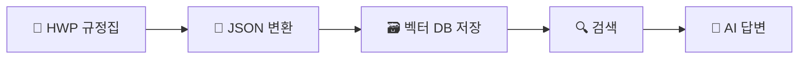
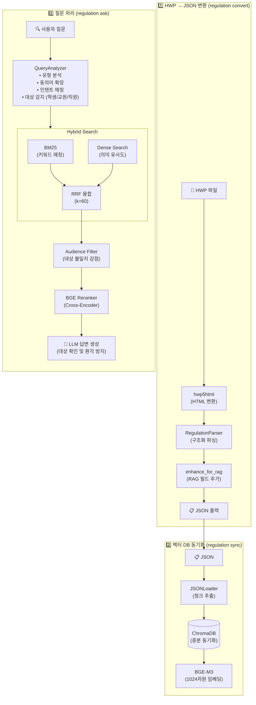
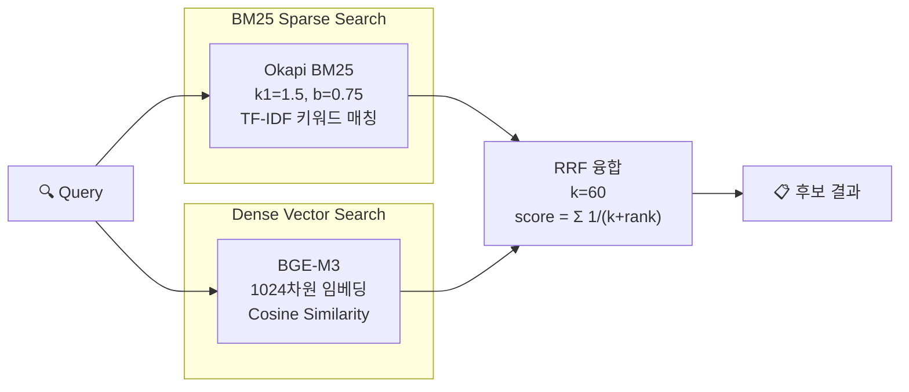
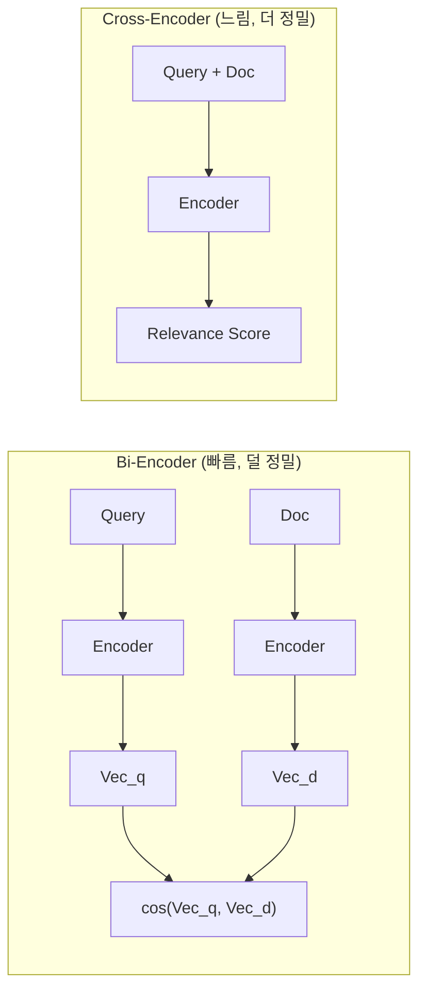

# 규정 관리 시스템

대학 규정집(HWP)을 구조화된 JSON으로 변환하고, AI 기반 검색을 제공하는 시스템입니다.

---

## 개요

이 시스템은 두 가지 핵심 기능을 제공합니다:

1. **규정 변환**: HWP 파일 → 구조화된 JSON
2. **규정 검색**: 자연어 질의 기반 AI 검색 및 답변 생성

```
[HWP 파일] → [JSON 변환] → [벡터 DB 저장] → [자연어 검색/질문]
```

---

## 사용 방법

### 설치

```bash
git clone <repository-url> && cd regulation_manager
uv venv && source .venv/bin/activate
uv sync
```

### 기본 워크플로우

```bash
# 1. HWP 파일을 JSON으로 변환
uv run regulation convert "data/input/규정집.hwp"

# 2. 벡터 DB에 저장
uv run regulation sync data/output/규정집.json

# 3. 규정 검색/질문 (통합 명령어)
uv run regulation search "교원 연구년 신청 자격은?"  # 자동으로 질문 인식 -> 답변 생성
uv run regulation search "연구년 규정"              # 자동으로 키워드 인식 -> 문서 검색

# 4. 강제 모드 사용 (선택)
uv run regulation search "연구년" -a   # 질문 모드 강제 (답변 생성)
uv run regulation search "연구년" -q   # 검색 모드 강제 (빠른 검색)
```

> **전문 보기(Full View)**는 웹 UI 또는 MCP에서 지원합니다.  
> (예: `교원인사규정 전문` / `교원인사규정 원문`)

### 검색 및 질문 옵션

| 옵션 | 설명 |
|------|------|
| `-a`, `--answer` | AI 답변 생성 강제 (Ask 모드) |
| `-q`, `--quick` | 문서 검색만 수행 (Search 모드) |
| `-n 10` | 검색 결과 개수 지정 |
| `--include-abolished` | 폐지된 규정 포함 (Search 모드) |
| `--no-rerank` | AI 재정렬 비활성화 (Search 모드) |
| `-v`, `--verbose` | 상세 정보 출력 (쿼리 분석, 모드 결정 이유 등) |

### LLM 질문 옵션

| 옵션 | 설명 |
|------|------|
| `--provider ollama` | LLM 프로바이더 (ollama, lmstudio, openai 등) |
| `--model gemma2` | 사용할 모델명 |
| `-v`, `--verbose` | 상세 정보 출력 (쿼리 분석, LLM 설정 등) |
| `--show-sources` | 참고 규정 전문 출력 |

### 웹 UI

비개발자를 위한 통합 웹 인터페이스를 제공합니다.

```bash
uv run regulation serve --web
```

파일 업로드 → 변환 → DB 동기화 → 질문까지 한 화면에서 진행할 수 있습니다.

**추가 기능**
- **전문 보기**: "전문/원문/전체" 요청 시 규정 전체 뷰 제공
- **대상 선택**: 교수/학생/직원 대상이 모호할 때 선택 UI 제공

### MCP 서버

AI 에이전트(Claude, Cursor 등)에서 규정 검색 기능을 사용할 수 있는 MCP(Model Context Protocol) 서버를 제공합니다.

```bash
# MCP 서버 실행 (stdio 모드)
uv run regulation serve --mcp
```

**지원 도구 (Tools)**:

| Tool | 설명 |
|------|------|
| `search_regulations` | 규정 검색 (Hybrid + Rerank) |
| `ask_regulations` | AI 질문-답변 |
| `get_sync_status` | 동기화 상태 조회 |

> DB 관리(sync, reset)는 CLI로 수행합니다.

**특징**
- `audience` 파라미터로 대상(교수/학생/직원) 지정 가능
- 모호한 질의는 `type=clarification` 응답 반환
- "전문/원문/전체" 요청은 `type=full_view` 응답 반환

**클라이언트 연결 설정** (Claude Desktop 예시):

```json
{
  "mcpServers": {
    "regulation-rag": {
      "command": "uv",
      "args": ["run", "regulation", "serve", "--mcp"],
      "cwd": "/path/to/regulation_manager"
    }
  }
}
```

---

## 명령어 요약

모든 기능은 `regulation` 단일 진입점으로 접근합니다.

| 명령어 | 설명 |
|--------|------|
| `regulation convert "파일.hwp"` | HWP → JSON 변환 |
| `regulation convert "파일.hwp" --use_llm` | LLM 전처리 활성화 |
| `regulation sync <json>` | JSON → 벡터 DB 동기화 |
| `regulation sync <json> --full` | 전체 재동기화 |
| `regulation search "<쿼리>"` | **규정 검색 및 AI 답변 (통합)** |
| `regulation search "<질문>" -a` | AI 답변 생성 강제 |
| `regulation search "<키워드>" -q` | 문서 검색 강제 |
| `regulation ask "<질문>"` | AI 답변 생성 (구버전 호환용) |
| `regulation status` | 동기화 상태 확인 |
| `regulation reset --confirm` | DB 초기화 |
| `regulation serve --web` | Web UI 시작 |
| `regulation serve --mcp` | MCP Server 시작 |

---

## 시스템 개요

### 작동 원리

대학 규정집(HWP)을 AI가 검색할 수 있는 형태로 변환하고, 자연어 질문에 대해 관련 규정을 찾아 답변을 생성합니다.



**처리 단계:**

| 단계 | 설명 |
|------|------|
| **1. 문서 구조화** | HWP 파일을 편/장/절/조/항/호/목 계층 구조로 파싱하여 JSON으로 변환 |
| **2. 벡터 DB 저장** | 각 조항을 임베딩하여 ChromaDB에 저장 (증분 동기화 지원) |
| **3. 하이브리드 검색** | 키워드 매칭(BM25)과 의미 유사도(Dense) 검색을 결합하여 관련 규정 탐색 |
| **4. 재정렬** | Cross-Encoder로 검색 결과를 정밀 평가하여 관련도 순으로 재정렬 |
| **5. 답변 생성** | LLM이 상위 규정을 참고하여 질문에 대한 답변 작성 |

---

### 기술 아키텍처



---

## 상세 처리 단계

### 1️⃣ HWP → JSON 변환 (문서 구조화)

HWP 파일의 복잡한 규정 내용을 **계층적 JSON 구조**로 변환합니다.

**처리 단계:**

| 단계 | 컴포넌트 | 설명 |
|------|----------|------|
| 1 | `hwp5html` | HWP를 HTML/XHTML로 변환 |
| 2 | `RegulationParser` | 편/장/절/조/항/호/목 계층 구조 파싱 |
| 3 | `ReferenceResolver` | 상호 참조 해석 ("제15조 참조" → 링크) |
| 4 | `enhance_for_rag.py` | RAG 최적화 필드 추가 |

**변환 예시:**

```
[HWP 원본]                      [JSON 출력]
제4조 (용어의 정의)       →     { "display_no": "제4조",
  1. 학과(전공)란...              "title": "용어의 정의",
  6. 교육편제 조정은...           "children": [
    가. 통합이란...                 { "display_no": "6.", "text": "교육편제 조정은...",
    나. 신설이란...                   "children": [
    다. 폐지란...                       { "display_no": "다.", "text": "폐지란..." }
                                      ]}]}
```

**RAG 최적화 필드:**

| 필드 | 타입 | 설명 | 예시 |
|------|------|------|------|
| `parent_path` | `Array<string>` | 계층 경로 (Breadcrumb) | `["학과평가규정", "제4조 용어의 정의", "6. 교육편제 조정"]` |
| `embedding_text` | `string` | 임베딩용 텍스트 | `"제4조 > 6. 교육편제 조정 > 다. 폐지: 폐지란..."` |
| `keywords` | `Array<{term, weight}>` | 핵심 키워드 | `[{"term": "학과", "weight": 0.9}]` |
| `chunk_level` | `string` | 청크 레벨 | `article`, `paragraph`, `item` |
| `is_searchable` | `boolean` | 검색 대상 여부 | `true` |

---

### 2️⃣ 벡터 DB 동기화 (ChromaDB)

변환된 JSON의 각 조항을 **청크(Chunk)** 단위로 분리하여 ChromaDB에 저장합니다.

**기술 사양:**

| 항목 | 값 | 설명 |
|------|---|------|
| **벡터 DB** | ChromaDB | 로컬 영속 저장 (`data/chroma_db/`) |
| **임베딩 모델** | `BAAI/bge-m3` | 1024차원, 다국어 지원, 한국어 최적화 |
| **청크 단위** | 조항(Article) 기준 | 평균 ~50 토큰/청크 |
| **동기화 방식** | 증분 동기화 | 해시 비교로 변경분만 업데이트 |

**메타데이터 스키마:**

```python
{
    "id": "uuid5(...)",           # 결정적 UUID (재생성 시 동일)
    "rule_code": "3-1-24",        # 규정 번호
    "regulation_name": "교원연구년제규정",
    "parent_path": ["교원연구년제규정", "제3조 자격"],
    "status": "active",           # active / abolished
    "effective_date": "2020-04-01",
}
```

---

### 3️⃣ 질문(Ask) 처리 파이프라인

사용자가 `regulation ask "질문"`을 실행하면 다음 단계로 처리됩니다.

#### Step 3-1: 쿼리 분석 (QueryAnalyzer)

```python
# 입력
query = "교원 연구년 신청 자격은 무엇인가요?"

# 분석 결과
{
    "query_type": "natural_question",    # 쿼리 유형
    "bm25_weight": 0.3,                  # Sparse 가중치
    "dense_weight": 0.7,                 # Dense 가중치
    "expanded_query": "교원 연구년 신청 자격 연구년제 자격요건",  # 동의어 확장
    "cleaned_query": "교원 연구년 신청 자격",  # 불용어 제거
    "audience": "FACULTY",               # 감지된 대상 (STUDENT/FACULTY/STAFF/ALL)
}
```

**대상 감지 (Audience Detection):**
질문 키워드를 분석하여 적용 대상을 감지합니다.
- `FACULTY`: 교수, 교원, 강사, 연구년 등
- `STUDENT`: 학생, 학부, 수강, 성적, 장학 등
- `STAFF`: 직원, 행정, 승진, 전보 등
```

**쿼리 유형별 가중치:**

| 쿼리 유형 | 패턴 예시 | BM25 | Dense |
|-----------|----------|------|-------|
| 조문 번호 | `"제15조"`, `"학칙 제3조"` | 0.6 | 0.4 |
| 규정명 | `"장학금규정"`, `"휴학 학칙"` | 0.5 | 0.5 |
| 자연어 질문 | `"어떻게 휴학하나요?"` | 0.4 | 0.6 |
| 의도 표현 | `"학교에 가기 싫어"` | 0.35 | 0.65 |
| 기본값 | 그 외 | 0.5 | 0.5 |

#### Step 3-2: Hybrid Search

두 가지 검색 방식을 결합하여 정확도를 높입니다.



**BM25 수식:**

$$\text{BM25}(q, d) = \sum_{t \in q} \text{IDF}(t) \cdot \frac{f(t,d) \cdot (k_1 + 1)}{f(t,d) + k_1 \cdot (1 - b + b \cdot \frac{|d|}{\text{avgdl}})}$$

**RRF 융합 수식:**

$$\text{RRF}(d) = \sum_{r \in \text{ranklists}} \frac{1}{k + r(d)}$$

**대상 필터링 (Audience Filter):**
감지된 대상과 규정의 대상이 불일치하면 **페널티(0.5x 감점)**를 부여하여 하단으로 내립니다.
- `FACULTY` 질문 (예: "교수 징계") → `학생` 관련 규정 감점
- `STUDENT` 질문 (예: "장학금") → `교직원` 관련 규정 감점

#### Step 3-3: Reranking (BGE Cross-Encoder)

Bi-Encoder 검색 결과를 Cross-Encoder로 재정렬합니다.

| 항목 | 값 |
|------|---|
| **모델** | `BAAI/bge-reranker-v2-m3` |
| **방식** | Cross-Encoder (Query-Document Pair Scoring) |
| **입력** | `[query, document]` 쌍 |
| **출력** | Relevance Score (0~1) |

**Bi-Encoder vs Cross-Encoder:**



**보너스 점수:**

| 조건 | 보너스 | 설명 |
|------|--------|------|
| 조문 번호 정확 매칭 | +0.15 | Query에 `제N조` 포함 & Doc에 동일 조문 |
| 규정명 정확 매칭 | +0.10 | Query에 규정명 포함 |

#### Step 3-4: LLM 답변 생성

Reranking된 상위 문서를 Context로 제공하여 LLM이 답변을 생성합니다.

**Context 구성:**

```
[1] 규정: 교원연구년제규정 (3-1-24)
경로: 교원연구년제규정 > 제3조 자격
내용: ① 첫번째 연구년제를 위한 근무년수: 본 대학교에 6년 이상 재직한 자...
관련도: 0.99

[2] 규정: 교원파견연구에관한규정 (3-1-61)
경로: 교원파견연구에관한규정 > 제3조 자격
내용: 파견연구 대상자는 본 대학교 전임교원으로서...
관련도: 0.95
```

**Prompt 구조:**

```
당신은 대학 규정 전문가입니다. 아래 규정을 참고하여 질문에 답변하세요.

[규정 내용]
{context}

[질문]
{question}

[지시사항]
- 규정에 명시된 내용만 답변하세요.
- 규정에 없는 내용은 "규정에 명시되어 있지 않습니다"라고 답변하세요.
- 출처 규정 번호를 함께 명시하세요.
```

**신뢰도 계산:**

```python
confidence = mean(top_n_reranker_scores) * answer_coverage_ratio
# top_n_reranker_scores: 상위 N개 Reranker 점수
# answer_coverage_ratio: 답변에 인용된 규정 비율
```

---

### 4️⃣ 증분 동기화

월간 규정 업데이트 시 변경된 규정만 동기화하여 처리 시간을 단축합니다.

**동기화 알고리즘:**

```python
for regulation in new_json:
    hash = sha256(regulation_content)
    if hash != stored_hash:
        if regulation_id in store:
            update(regulation)  # 수정
        else:
            add(regulation)     # 신규
    
for stored_id in store:
    if stored_id not in new_json:
        delete(stored_id)       # 삭제
```

**상태 파일 (`sync_state.json`):**

```json
{
  "last_sync": "2025-12-26T10:36:09Z",
  "json_file": "규정집9-343(20250909).json",
  "regulations": {
    "3-1-24": {"hash": "abc123...", "chunk_count": 54},
    "3-1-61": {"hash": "def456...", "chunk_count": 32}
  }
}
```

---

## 환경 설정

```bash
cp .env.example .env
```

**주요 설정:**

```bash
# LLM 기본값
LLM_PROVIDER=ollama
LLM_MODEL=gemma2
LLM_BASE_URL=http://localhost:11434

# API 키 (클라우드 LLM 사용 시)
OPENAI_API_KEY=sk-...
GEMINI_API_KEY=AIza...

# 동의어/인텐트 사전 (기본 제공, 커스텀 시 경로 변경)
RAG_SYNONYMS_PATH=data/config/synonyms.json
RAG_INTENTS_PATH=data/config/intents.json
```

실행 시 `.env`를 자동 로드하므로, 위 설정이 코드 기본값보다 우선 적용됩니다.

코드 기본값(옵션/`.env` 미설정 시):

| 사용 위치 | LLM 기본값 |
|-----------|------------|
| `regulation convert` | provider: `openai` (model: `gpt-4o`) |
| `regulation ask` / 웹 UI | provider: `ollama` (model: `gemma2`, base_url: `http://localhost:11434`) |

### 동의어 및 인텐트 사전

시스템은 검색 품질 향상을 위해 **동의어 사전**과 **인텐트 규칙**을 기본 제공합니다.

**기본 제공 데이터:**

| 항목 | 수량 | 파일 |
|------|------|------|
| 동의어 용어 | 167개 | `data/config/synonyms.json` |
| 인텐트 규칙 | 51개 | `data/config/intents.json` |

**동의어 사전 예시:**
- `"폐과"` → `["학과 폐지", "전공 폐지"]`
- `"교수"` → `["교원", "교직원", "전임교원"]`

**인텐트 규칙 예시:**
- `"학교에 가기 싫어"` → `["휴직", "휴가", "연구년", "안식년"]`
- `"그만두고 싶어"` → `["퇴직", "사직", "명예퇴직"]`

**Verbose 모드로 확인:**

```bash
# 쿼리 분석 과정 확인
uv run regulation search "학교에 가기 싫어" -v

# 출력 예시:
# 🔄 쿼리 분석 결과
# ℹ 📋 규칙 기반 확장
# ℹ    원본: '학교에 가기 싫어'
# ℹ    변환: '학교에 가기 싫어 휴직 휴가 연구년 안식년 병가 연가'
# ℹ 📚 동의어 사전: ✅ 적용됨
# ℹ 🎯 의도 인식: ✅ 매칭됨
# ℹ    매칭된 의도: [휴직 / 휴가, 근무 회피]
```

**커스텀 사전 사용:**

환경변수로 다른 파일을 지정할 수 있습니다:

```bash
# .env 파일
RAG_SYNONYMS_PATH=data/config/synonyms.json
RAG_INTENTS_PATH=data/config/intents.json
```

---

## 문서

| 문서 | 설명 |
|------|------|
| [QUICKSTART.md](./QUICKSTART.md) | 빠른 시작 가이드 |
| [LLM_GUIDE.md](./LLM_GUIDE.md) | LLM 설정 가이드 |
| [SCHEMA_REFERENCE.md](./SCHEMA_REFERENCE.md) | JSON 출력 스키마 명세 |
| [AGENTS.md](./AGENTS.md) | 개발자 가이드 |

---

## 문제 해결

| 문제 | 해결 방법 |
|------|----------|
| "데이터베이스가 비어 있습니다" | `sync` 명령 실행 |
| "파일을 찾을 수 없습니다" | 파일 경로 확인 (절대 경로 권장) |
| 검색 결과가 부정확함 | `--no-rerank` 제거하여 AI 재정렬 활성화 확인 |
| 변환 품질이 낮음 | `--use_llm` 옵션으로 LLM 전처리 활성화 |
| "hwp5html 실행 파일을 찾을 수 없습니다" | `hwp5html` 설치 후 다시 실행 (변환은 hwp5html CLI 필요) |

---

# 개발자 가이드

> 상세한 개발 가이드, 코딩 규칙, Clean Architecture 원칙은 [AGENTS.md](./AGENTS.md)를 참고하세요.

## 프로젝트 구조

```
regulation_manager/
├── src/
│   ├── main.py              # 변환 파이프라인 진입점
│   ├── converter.py         # HWP → Markdown/HTML
│   ├── formatter.py         # Markdown → JSON
│   ├── enhance_for_rag.py   # RAG 최적화 필드 추가
│   ├── parsing/             # 파싱 모듈
│   └── rag/                 # RAG 시스템 (Clean Architecture)
│       ├── interface/       # CLI, Web UI, MCP Server
│       ├── application/     # Use Cases
│       ├── domain/          # 도메인 모델
│       └── infrastructure/  # ChromaDB, Reranker, LLM
├── data/
│   ├── input/               # HWP 파일 입력
│   ├── output/              # JSON 출력
│   ├── chroma_db/           # 벡터 DB 저장소
│   └── config/              # 동의어/인텐트 사전
└── tests/                   # pytest 테스트
```

## 개발 명령어

```bash
# 테스트 실행
uv run pytest

# 의존성 추가
uv add <package>
```

## 요구 사항

- Python 3.11+
- `uv` 패키지 매니저
- `hwp5` 라이브러리 + `hwp5html` CLI (HWP 파일 처리)

---

## 관련 문서

- [QUICKSTART.md](./QUICKSTART.md) - 빠른 시작 가이드
- [LLM_GUIDE.md](./LLM_GUIDE.md) - LLM 설정 가이드
- [SCHEMA_REFERENCE.md](./SCHEMA_REFERENCE.md) - JSON 스키마 명세
- [USAGE_SCENARIOS.md](./USAGE_SCENARIOS.md) - 실제 사용 시나리오
- [PRODUCT_BACKLOG.md](./PRODUCT_BACKLOG.md) - 제품 수준 백로그
- [UX_FLOWS.md](./UX_FLOWS.md) - 웹/MCP UX 플로우
- [UX_COPY.md](./UX_COPY.md) - UX 카피/컴포넌트 문구
- [TASKS_BACKLOG.md](./TASKS_BACKLOG.md) - 모듈별 액션 티켓
