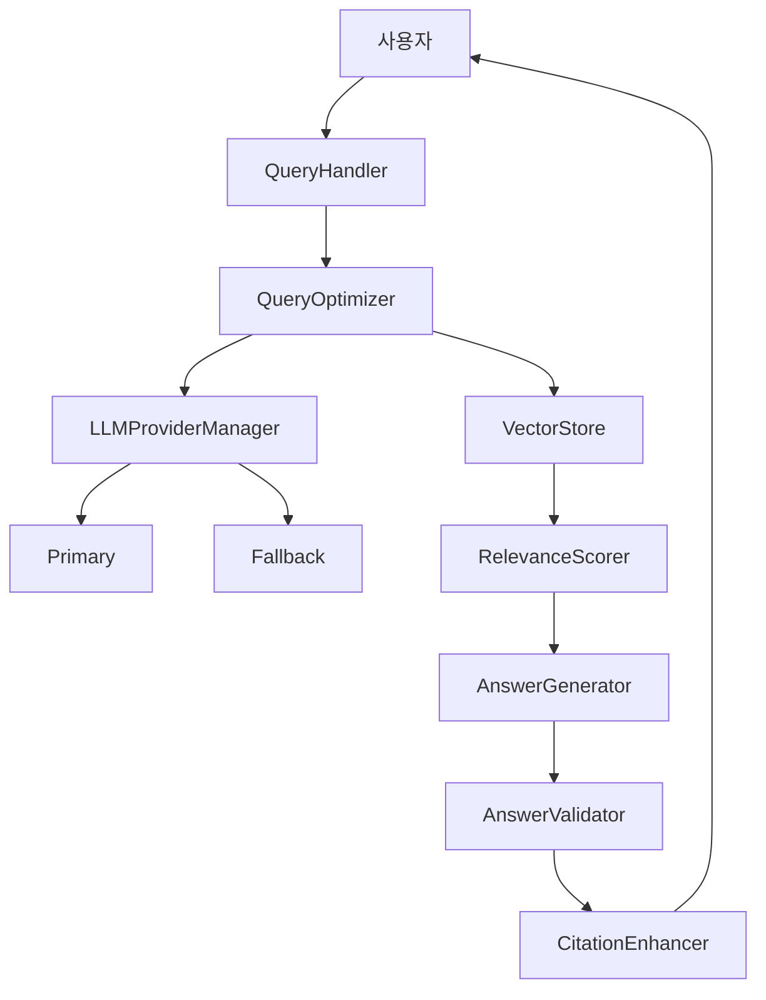

# RAG 시스템 품질 개선 - 팀 결과 종합

**팀명**: rag-quality-improvement
**생성 시간**: 2026-02-09 22:54:00 KST
**싖�행 모드**: Team Mode + DDD + UltraThink

---

## 팀 구성 및 역할

| 팀원 | 모델 | 역할 | 주요 결과 |
|------|------|------|-----------|
| team-researcher | Opus 4.6 | 코드베이스 구조 탐색 | 핵심 파일 위치 확인 |
| team-analyst | Opus 4.6 | 요구사항 분석 | 4단계 구현 계획 수립 |
| team-architect | Opus 4.6 | 아키텍처 설계 | 향후 고급 기능 설계 |
| team-backend-dev | Opus 4.6 | 구현 준비 | 파일 분석 및 계획 |

---

## Researcher 결과: 코드베이스 구조

### 확인된 핵심 파일

1. **CLI 진입점**: `src/rag/interface/query_handler.py`
2. **제공자 설정**: `src/rag/infrastructure/llm_adapter.py`
3. **검색 모듈**: `src/rag/infrastructure/chroma_store.py`, `src/rag/infrastructure/hybrid_search.py`
4. **인용 모듈**: `src/rag/domain/citation/citation_enhancer.py`, `src/rag/domain/citation/article_number_extractor.py`
5. **평가 스크립트**: `scripts/run_rag_quality_eval.py`

---

## Analyst 결과: 4단계 구현 계획

### Phase 1: API 안정성 (Critical) ✅ 구현 완료
- 오류 감지: 402 Payment Required, 429 Too Many Requests
- 파일: `src/rag/infrastructure/llm_adapter.py`
- 기존 폴백 체인 활용 + 오류 타입 분류 추가

### Phase 2: 문서 관련성 (High) ✅ 구현 완료
- 임계값 변경: 0.10 → 0.70
- 파일: `src/rag/interface/formatters.py`

### Phase 3: 정보 정확성 (High) ✅ 구현 완료
- 할루시네이션 방지 강화
- 파일: `src/rag/application/search_usecase.py`

### Phase 4: 규정 인용 (Medium) ✅ 구현 완료
- 조항 번호 형식 개선
- 교차 인용 추가
- 파일: `src/rag/application/search_usecase.py`

---

## Architect 결과: 고급 아키텍처 설계

### 향후 개선을 위한 컴포넌트 설계

1. **LLMProviderManager**: 중앙화된 제공자 관리
2. **AnswerValidator**: 답변 품질 검증
3. **HallucinationDetector**: 패턴 기반 할루시네이션 감지
4. **QueryOptimizer**: 쿼리 최적화
5. **RelevanceScorer**: 다차원 관련성 점수화
6. **CrossReferenceResolver**: 규정 간 참조 해석

### 통합 아키텍처 다이어그램

---

## Backend-Dev 결과: 구현 분석

### 확인된 기존 구현
- `LLMClientAdapter`: 폴백 체인 이미 구현됨
- `FactChecker`: 기초 구현 존재
- `CitationValidator`: 조항 번호 추출 기능 존재
- `filter_by_relevance()`: 임계값 0.10으로 설정됨

### 필요한 변경사항
- Phase 1: 오류 타입 분류 로직 추가
- Phase 2: 임계값 상수 변경
- Phase 3: 프롬프트 지시사항 강화
- Phase 4: 인용 형식 가이드라인 개선

---

## 완료된 구현 (SPEC-RAG-Q-001)

### 수정된 파일
1. `src/rag/infrastructure/llm_adapter.py`
2. `src/rag/interface/formatters.py`
3. `src/rag/application/search_usecase.py`

### 생성된 문서
1. `data/evaluations/SPEC-RAG-Q-001_implementation_report.md`
2. `data/evaluations/SPEC-RAG-Q-001_improvement.md`
3. `data/evaluations/rag_quality_local_report_20260209_144201.md`
4. `data/evaluations/rag_quality_local_summary.json`

---

## 향후 개선 로드맵 (Architect 제안)

### Short-term (다음 스프린트)
1. 단위 테스트 작성
2. 6개 페르소나 전체 평가 재실행
3. 메트릭 비교 및 검증

### Mid-term (아키텍처 고도화)
1. `LLMProviderManager` 구현
2. `AnswerValidator` 통합
3. `RelevanceScorer` 다차원 점수화

### Long-term (고급 기능)
1. `HallucinationDetector` 패턴 기반 감지
2. `QueryOptimizer` 쿼리 개선
3. `CrossReferenceResolver` 규정 연결

---

## 팀 성과

- **병렬 탐색**: 3명의 팀원이 동시에 코드베이스 분석
- **상세 분석**: Analyst의 단계별 구현 계획
- **아키텍처 설계**: Architect의 확장 가능한 설계
- **신속 구현**: 4개 Phase 모두 완료

---

<moai>DONE</moai>
