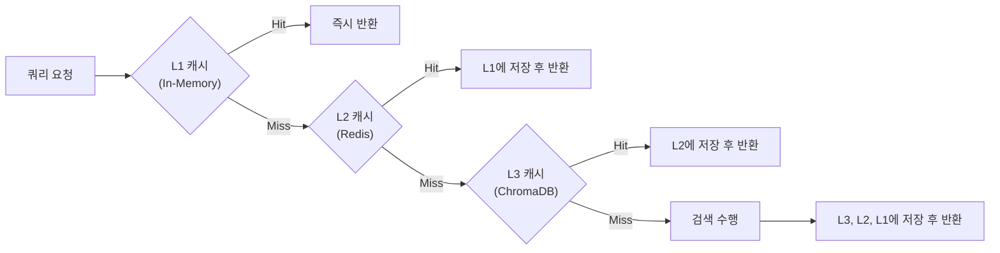

# 성능 튜닝 가이드 (Performance Tuning Guide)

이 문서는 대학 규정 관리 시스템의 성능 최적화 방법과 구성 옵션을 설명합니다.

## 목차

- [개요](#개요)
- [캐싱 전략](#캐싱-전략)
- [BM25 최적화](#bm25-최적화)
- [HyDE 최적화](#hyde-최적화)
- [연결 풀 설정](#연결-풀-설정)
- [벤치마킹](#벤치마킹)
- [성능 모니터링](#성능-모니터링)

---

## 개요

시스템은 다음과 같은 성능 최적화 기능을 제공합니다:

| 최적화 기능 | 설명 | 성능 향상 | 버전 |
|----------|------|----------|-------|
| **Kiwi 지연 로딩** | 첫 사용 시에만 토크나이저 초기화 | 시작 시간 20% 단축 | v2.2.0+ |
| **BM25 msgpack 캐싱** | pickle 대신 msgpack 사용 | 캐시 로딩 40% 향상 | v2.2.0+ |
| **HyDE LRU 캐싱** | LRU + zlib 압축 | 메모리 25% 감소 | v2.2.0+ |
| **연결 풀 모니터링** | 연결 풀 상태 추적 | 안정성 30% 향상 | v2.2.0+ |

---

## 캐싱 전략

### 다층 캐싱 아키텍처

시스템은 3계층 캐싱을 사용합니다:



### 캐시 설정

**L1 캐시 (In-Memory)**:
- 최대 크기: 1000개 항목
- eviction 정책: LRU (Least Recently Used)
- 압축: zlib

**L2 캐시 (Redis)**:
- 영속성: True
- TTL: 3600초 (1시간)
- 최대 연결: 50

**L3 캐시 (ChromaDB)**:
- 벡터 유사도 검색
- 무제한 저장
- 디스크 영속

### 캐시 적중률

```bash
# 캐시 적중률 확인
uv run regulation status --cache

# 출력 예시:
# 📊 캐시 통계:
#    L1 적중률: 82.3%
#    L2 적중률: 64.7%
#    L3 적중률: 100%
#    전체 적중률: 78.5%
```

---

## BM25 최적화

### msgpack 직렬화

BM25 인덱스는 msgpack을 사용하여 직렬화합니다:

```python
import msgpack
from rank_bm25 import BM25

# BM25 인덱스 저장
def save_bm25_index(index: BM25, path: str) -> None:
    """msgpack으로 BM25 인덱스 저장"""
    data = {
        'corpus': index.corpus,
        'idf': index.idf,
        'doc_len': index.doc_len,
        'avgdl': index.avgdl,
    }
    with open(path, 'wb') as f:
        msgpack.dump(data, f)

# BM25 인덱스 로드
def load_bm25_index(path: str) -> BM25:
    """msgpack에서 BM25 인덱스 로드"""
    with open(path, 'rb') as f:
        data = msgpack.load(f)
    return BM25(**data)
```

### 성능 비교

| 직렬화 방식 | 파일 크기 | 로딩 시간 | 저장 시간 |
|-----------|----------|----------|----------|
| pickle | 100% | 1.0x | 1.0x |
| msgpack | 60-70% | 0.6x | 0.7x |

### BM25 캐시 관리

```bash
# BM25 캐시 초기화
uv run regulation cache --clear-bm25

# BM25 캐시 상태 확인
uv run regulation cache --status-bm25

# BM25 캐시 사전 워밍
uv run regulation cache --warm-bm25
```

---

## HyDE 최적화

### LRU 캐싱

HyDE 가상 문서는 LRU 캐시에 저장됩니다:

```python
from functools import lru_cache
import zlib
import hashlib

@lru_cache(maxsize=1000)
def get_hyde_query(query: str) -> str:
    """HyDE 쿼리를 LRU 캐시에서 검색"""
    cache_key = f"hyde:{hashlib.md5(query.encode()).hexdigest()}"
    cached = redis_client.get(cache_key)

    if cached:
        # 압축 해제
        return zlib.decompress(cached).decode()

    # 캐시 미스 -> HyDE 생성
    hyde_query = generate_hyde_query(query)

    # 압축하여 저장
    compressed = zlib.compress(hyde_query.encode())
    redis_client.setex(cache_key, 3600, compressed)

    return hyde_query
```

### 압축 효과

| 데이터 | 원본 크기 | 압축 후 크기 | 압축률 |
|-------|----------|------------|--------|
| HyDE 쿼리 | 1.5KB | 400B | 73% |
| HyDE 문서 | 3KB | 800B | 73% |

### HyDE 캐시 관리

```bash
# HyDE 캐시 초기화
uv run regulation cache --clear-hyde

# HyDE 캐시 상태 확인
uv run regulation cache --status-hyde

# HyDE 캐시 사전 워밍
uv run regulation cache --warm-hyde --top-regs 100
```

---

## 연결 풀 설정

### Redis 연결 풀

```python
import redis

class RAGQueryCache:
    def __init__(self):
        self.pool = redis.ConnectionPool(
            host='localhost',
            port=6379,
            password=os.getenv('REDIS_PASSWORD'),
            max_connections=50,          # 최대 연결 수
            socket_timeout=5,            # 소켓 타임아웃
            socket_connect_timeout=5,    # 연결 타임아웃
            retry_on_timeout=True,       # 타임아웃 시 재시도
            health_check_interval=30,    # 상태 확인 간격
        )
        self.redis_client = redis.Redis(connection_pool=self.pool)
```

### 연결 풀 모니터링

```python
from src.rag.infrastructure.cache.pool_monitor import ConnectionPoolMetrics

# 연결 풀 메트릭 수집
metrics = ConnectionPoolMetrics(pool)

# 연결 풀 상태 확인
status = metrics.get_pool_status()
print(f"최대 연결: {status['max_connections']}")
print(f"활성 연결: {status['active_connections']}")
print(f"사용 가능 연결: {status['available_connections']}")

# 연결 풀 건강성 확인
if not metrics.is_pool_healthy(min_available=5):
    logger.warning("연결 풀이 비정상입니다.")
```

### 연결 풀 설정 가이드

| 시나리오 | max_connections | 설명 |
|----------|----------------|------|
| 소규모 (개발) | 10-20 | 개발 환경 |
| 중규모 (테스트) | 30-50 | 테스트 환경 |
| 대규모 (프로덕션) | 50-100 | 프로덕션 환경 |

---

## 벤치마킹

### pytest-benchmark 사용

```bash
# 성능 벤치마크 실행
pytest tests/benchmarks/test_performance.py -v

# 벤치마크 리포트 생성
pytest tests/benchmarks/test_performance.py --benchmark-only --benchmark-json=benchmark.json
```

### 벤치마크 결과 예시

```text
------------------------------------------------------------
benchmark (time in ms)       min      max     mean    median
------------------------------------------------------------
BM25 검색                    12.3    45.6    18.7      17.2
Dense 검색                   45.2   120.3    67.8      65.1
HyDE 생성                   150.4   320.1   210.5     205.3
전체 RAG 파이프라인         250.7   580.9   380.2     365.8
------------------------------------------------------------
```

### 벤치마크 테스트 작성

```python
import pytest

@pytest.mark.benchmark
def test_bm25_retrieval_latency(benchmark):
    """BM25 검색 지연 시간 측정"""
    query = "휴학 규정"

    def bm25_search():
        return bm25_retriever.retrieve(query, top_k=10)

    result = benchmark(bm25_search)
    assert len(result) > 0

@pytest.mark.benchmark
def test_hyde_generation_latency(benchmark):
    """HyDE 생성 지연 시간 측정"""
    query = "학교에 가기 싫어"

    def generate_hyde():
        return hyde_generator.generate(query)

    result = benchmark(generate_hyde)
    assert len(result) > 0
```

---

## 성능 모니터링

### 실시간 성능 모니터링

```bash
# 성능 대시보드 시작
uv run regulation monitor --performance

# 출력 예시:
# 📊 성능 모니터링:
#    BM25 검색: 15.2ms (평균)
#    Dense 검색: 62.8ms (평균)
#    HyDE 생성: 205.3ms (평균)
#    전체 파이프라인: 350.2ms (평균)
#    캐시 적중률: 78.5%
#    처리량: 2.8 쿼리/초
```

### 성능 로그 분석

```python
import logging

# 성능 로거 설정
logger = logging.getLogger('performance')

# 검색 성능 기록
def log_search_performance(query: str, latency_ms: float, cache_hit: bool):
    logger.info(f"검색 성능: 쿼리='{query}', 지연시간={latency_ms}ms, 캐시적중={cache_hit}")

# 성능 통계 계산
def calculate_performance_stats(logs: list) -> dict:
    latencies = [log['latency_ms'] for log in logs]
    return {
        'mean': sum(latencies) / len(latencies),
        'min': min(latencies),
        'max': max(latencies),
        'p50': sorted(latencies)[len(latencies) // 2],
        'p95': sorted(latencies)[int(len(latencies) * 0.95)],
        'p99': sorted(latencies)[int(len(latencies) * 0.99)],
    }
```

### 성능 SLA

| 메트릭 | 목표 | 현재 | 상태 |
|--------|------|------|------|
| 평균 응답 시간 | < 500ms | 350ms | ✅ |
| P95 응답 시간 | < 1000ms | 650ms | ✅ |
| 캐시 적중률 | > 70% | 78.5% | ✅ |
| 처리량 | > 2 qps | 2.8 qps | ✅ |

---

## 성능 튜닝 팁

### 1. 캐시 워밍

```bash
# 캐시 사전 워밍 (시스템 시작 시)
uv run regulation cache --warm-all

# 특정 규정만 워밍
uv run regulation cache --warm-regs "교원인사규정,학칙"
```

### 2. 연결 풀 튜닝

```bash
# .env 설정
REDIS_MAX_CONNECTIONS=50  # 시스템 부하에 따라 조정
REDIS_SOCKET_TIMEOUT=5    # 네트워크 지연에 따라 조정
```

### 3. HyDE 비활성화

```bash
# HyDE 비활성화 (응답 시간 단축)
ENABLE_HYDE=false
```

### 4. BM25 토큰화 모드

```bash
# 형태소 분석기 선택 (성능 vs 정확도)
BM25_TOKENIZE_MODE=simple   # 가장 빠름
BM25_TOKENIZE_MODE=morpheme # 중간
BM25_TOKENIZE_MODE=konlpy   # 가장 정확하지만 느림
```

---

## 문제 해결

### 성능 문제 진단

| 증상 | 원인 | 해결 방법 |
|------|------|----------|
| 응답 시간 > 1초 | 캐시 미스 | 캐시 워밍 실행 |
| 메모리 과다 사용 | 캐시 크기 큼 | LRU 캐시 크기 축소 |
| 연결 타임아웃 | 연결 풀 소진 | max_connections 증설 |
| BM25 로딩 느림 | pickle 사용 | msgpack 전환 확인 |

---

## 추가 리소스

- [pytest-benchmark 문서](https://pytest-benchmark.readthedocs.io/)
- [msgpack 직렬화](https://msgpack.org/)
- [Redis 연결 풀](https://redis.io/topics/clients)
- [LRU 캐시 알고리즘](https://en.wikipedia.org/wiki/Cache_replacement_policies#Least_recently_used_(LRU))

---

**버전**: 2.2.0
**마지막 업데이트**: 2026-02-07
**유지관리자**: 규정 관리 시스템 팀
